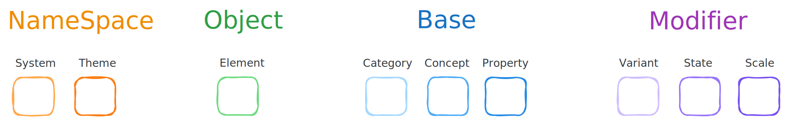
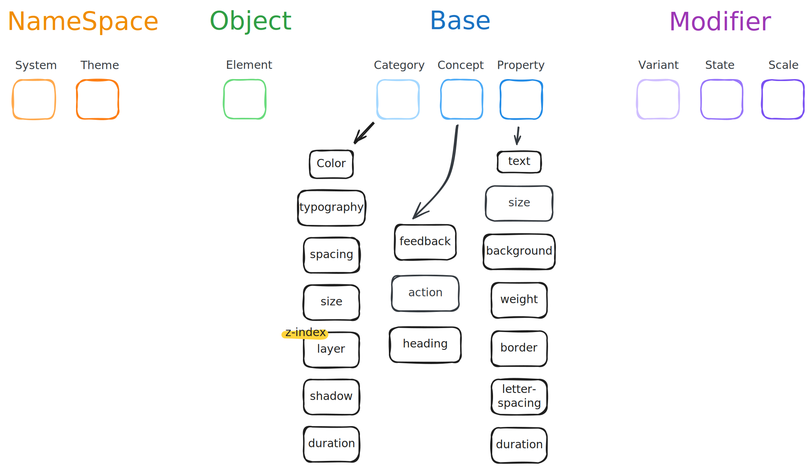
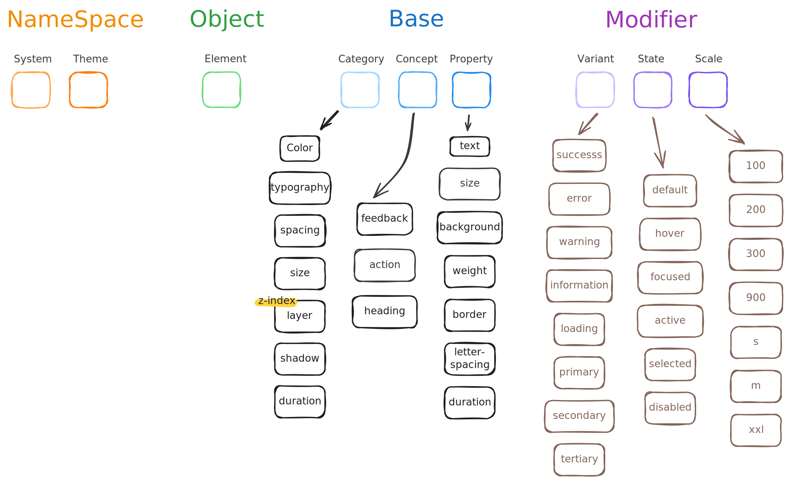
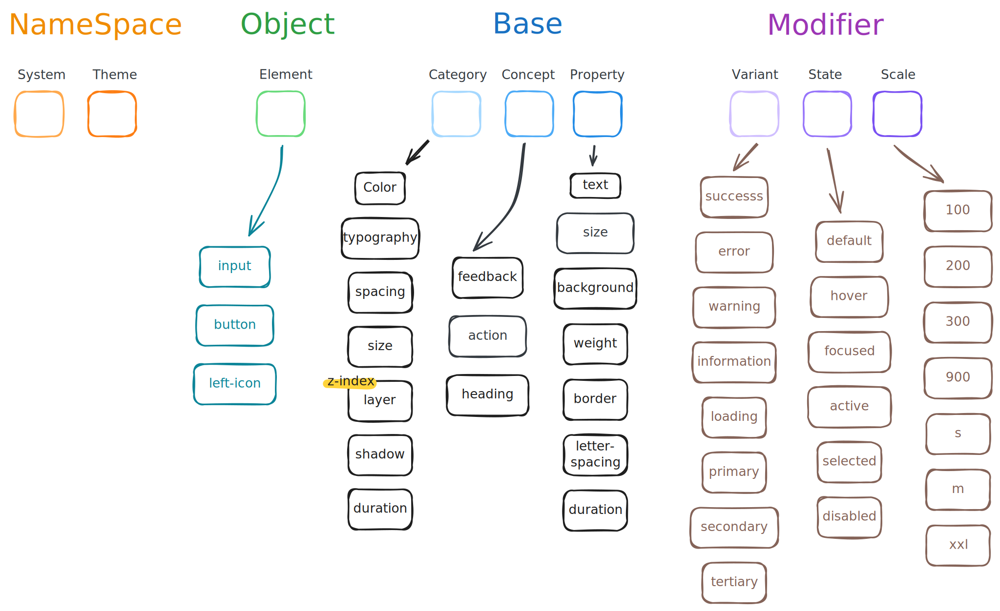
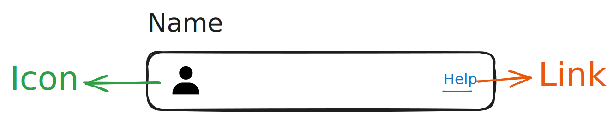
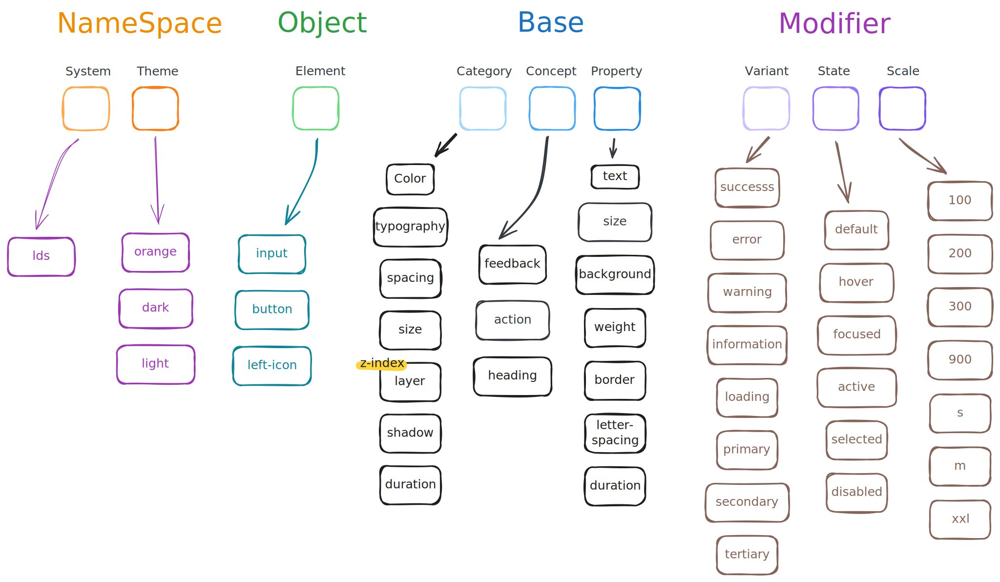

## **디자인 토큰은 무엇일까요?**

디자인 토큰은 `colors`, `spacing`, `typography` `scale`과 같은 디자인 시스템을 구성하는 최소 단위입니다.

## **디자인 토큰은 왜 도입하나요?**

효과적인 토큰 이름은 디자인, 코드 간 핸드오프를 통해 시각적 스타일에 대한 일관성을 가지게 됩니다. 그리고 프로젝트를 확장해나갈 때 도움됩니다.

## **디자인 토큰을 어떻게 의미있게 설계할 수 있을까요?**

간단한 토큰부터 시작해서 다양한 의미를 가질 수 있는 탄탄한 토큰을 설계하는 방법에 대해 설명해보겠습니다.

색상을 예로 들어보겠습니다. `blue-500`은 `rgb(59 130 246)` 값을 나타냅니다. 제품을 확장하려면 더 구체적인 토큰으로 이어질 필요가 있습니다. 예로 '포인터가 사용자와 상호작용하는 요소 위에 놓이면(hover) 색상으로 rgb(59 130 246)를 적용한다'는 `action-hover-color-blue-500` 토큰으로 정의할 수 있습니다.

두 표현처럼 선언해두면 선언하지 않은 색상은 사용하지 않게 강제할 수 있는 이점도 가져옵니다. 이를 통해 일관성을 유지하고 관리하며 확장해나갈 수 있습니다. 조금 더 나아가보겠습니다.

만약 디자이너가 '이 버튼의 배경 색상은 primary 브랜드 색상으로 표현해주세요.'라고 요청한 상황을 가정해보겠습니다. 위처럼 `blue-500`, `violet-400`처럼 선언해 둔 여러 색상 토큰 중에선 쉽게 찾을 수 없을 것입니다. 그래서 토큰에 의도를 담으면 더 좋습니다. 예를 들어 `blue-500`을 `primary`로 바꾸면 `color-primary`가 되므로 의도를 알기 쉽습니다. 그리고 primary는 blue-500으로 표현됩니다.

물론 더 많은 상황이 있을 것입니다. '사용자에게 성공했다는 피드백의 배경 색상은 rgb(74 222 128)로 표현해주세요.’ 의미를 토큰으로 어떻게 담을 수 있을까요? 여러 상황에 충분한 의미를 담기 위해서는 많은 레벨이 필요합니다.



- **Namespace**: System(Adobe), Theme(stone)을 결합한 레벨입니다.
- **Object**: Element(button)를 참조하는 레벨입니다.
- **Base**: Category(color), Concept(feedback), Property(background)를 결합한 수준으로 **기본 레벨**입니다.
- **Modifier**: Variant(success), State(hover), Scale(95) 중 하나 이상을 나타내는 레벨입니다.

이렇게 분류된 NameSpace, Object, Modifier 레벨을 기반으로 토큰 이름을 지정해보겠습니다.

### Base

Base 레벨의 Category와 Concept은 대부분의 토큰 이름을 나타내는 기본적인 구성이라고 볼 수 있습니다.



대부분의 토큰은 `color`, `spacing`, `typography` 와 같은 전형적인 Category 내에 속합니다.

Property에는 `weight`, `size` 등이 포함되며 다음과 같이 조합하여 토큰을 만들 수 있습니다:

```scss
// 흰 배경 색상
$color-background: #fff;
// 큰 텍스트
$typography-size: 2rem;
// 빨간 알림 배경 색상
$color-feedback-background: #fb3b1e;
```

Base 레벨만으론 의도를 표현하기 부족합니다. 이때 Modifier 개념을 적용시킬 수 있습니다.

<aside>
💡 반드시 **동음이의어**는 피해야 합니다!
Category 내 `typography`는 `typo` 또는 `text` 로도 정의할 수 있습니다. 하지만 이 경우 다양한 의미로 해석될 수 있기에 변수 이름에 사용하기 적합하지 않습니다. 때문에 조금 길더라도 `typography` 로 지정했습니다.

</aside>

### Modifier

Modifier는 **목적을 부여**할 수 있도록 합니다. Base 레벨의 개념과 결합하여 광범위한 문체 유형을 형성합니다.



예로 색상은 하나 이상의 Modifier를 추가함으로써 아래 개념으로 그룹화할 수 있습니다:

```scss
// feedback을 성공, 에러, 경고, 정보, 로딩 등으로 제공합니다.
$color-feedback-success
$color-feedback-error
// 상호작용 요소에 제공하는 색상을 제공합니다.
$color-action-primary
$color-action-secondary
```

이렇게 Modifier 레벨의 개념을 Base 레벨의 개념과 적절히 결합하면 다양한 토큰을 생성할 수 있습니다.

마찬가지로 Scale 개념을 사용하면 Title, SubTitle 개념으로도 그룹화할 수 있습니다:

```scss
// title
$typography-heading-xxl
// sub-title
$typography-heading-l
```

이렇듯 토큰에 충분한 의미가 담기려면 Modifier 레벨의 개념이 필요합니다. 각 개념에 대해 조금 더 명확히 들여다보겠습니다:

- **variant**: 여러 use-case를 구분합니다. `$color-typography-success`처럼 텍스트 색상을 다양하게 변경하여 계층 구조와 대비를 만들 수 있습니다. 여기서 중요한 건 **유연성보단 특정성에 더 가깝다**는 것입니다. 단순히 `color-success` 로 토큰명을 가지게 되면 더 다양한 상황에 적용 가능합니다. `typography` 뿐만 아니라 `background`, `border` 등에 말이죠. 온전히 사용자가 바라보는 관점에 맡겨집니다. 여기선 유연성보단 특정성을 챙겼습니다. `color-success` 색상은 `typography` 또는 `background` 중 한 가지에만 사용합니다. 더 나아가 `success` 상태를 반영하는 알림창의 `border`, `typography`, `background` 에 각각 다른 색상이 필요할 수 있습니다. 또한 여럿이서 작업할 때 더 명확하니 각 디자이너, 개발자가 같은 관점을 바라보고 사고할 수 있다는 점은 말할 필요도 없습니다.
- state: 인터랙션 상태를 구분합니다. 종종 `button-color-background-disabled` 처럼 Object 레벨과도 결합할 수 있습니다.
- scale: 다양한 크기 또는 옵션을 구분합니다.
  - heading 레벨의 1, 2, 3, 4, 5와 같은 열거형 값을 가집니다.
  - `100`, `200`, …`900`, `950`처럼 정렬된 값을 가집니다.
  - `s`, `m`, `l`로 시작해서 `xl`, `xxl`, `xs` 등으로 확장되는 값을 가집니다.

예를 들어, 사용성을 위해 모바일에서 인터랙티브 요소(a, button…)의 최소 높이는 `44px` 이상이어야 하는 경우가 있는데요. 이런 경우도 아래처럼 정의할 수 있습니다:

```css
html {
  --size-action-height-coarse: 32px;

  @media (pointer: coarse) {
    --size-action-height-coarse: 48px;
  }
}
button {
  min-height: var(--size-action-height-coarse);
}
```

전체 인터랙션 요소가 아닌 button에만 한정되도록 조금 더 범위를 좁히고 싶다면 Object 레벨을 결합하면 됩니다.

### Object

언급했듯이, Object 레벨은 하나의 컴포넌트, 요소에서만 재사용 가능하도록 지정할 때 유용합니다.



위의 예시에서 button에만 한정되도록 하고 싶다면 `$button-size-height-coarse` 처럼 지정할 수 있습니다. 이건 크게 와닿지 않는 예시라 의미가 있나 싶을 수도 있습니다.

다른 예시로, input 요소의 테두리에 회색 색상을 적용하기 위해 적용할 의미 있는 토큰이 없는 상황이라고 가정해보겠습니다. 색상 팔레트에 정의해 둔 `color-gray-500` 같은 일반적인 토큰을 사용하는 것으로 충분할 수 있습니다. 테두리가 항상 `gray-500` 색상이 아닌 성공, 에러 상태에 따라 색상이 바뀌어야 한다면 토큰으로 만들어 두고 싶을 수 있습니다. 이 테두리 색상이 버튼과 같은 다른 요소와 관련이 있을 수도 있지만 확실하지 않을 때 요소별로 토큰(`input-color-border-feedback-error`)을 만들어야 합니다. 그럼 어디에 생성하는 게 좋을까요?

특정 요소에 특정된 토큰을 전역에 위치해두는 것은 좋은 방법이 아닙니다. 해당 요소와 관련된 특정 위치에 기록해둬야 합니다. 그래야 후에 작업할 때 히스토리 파악도 용이하고 뭔가를 수정하면 어느 부분도 수정해야 할지 파악이 쉽습니다.



중첩된 요소가 포함된 인풋 요소

보통 input 요소에 아이콘이나 링크와 같은 중첩된 요소가 포함됩니다. 이러한 상황도 재사용에 적합한 경우입니다.

중첩된 요소에 대한 토큰은 [BEM CSS 방법론](https://css-tricks.com/bem-101/)처럼 컴포넌트 이름과 요소 이름을 모두 포함할 수 있습니다. 요소별 토큰은 `$input-prefix-icon-size`, `$input-inline-link-color-text`와 같이 정의할 수 있습니다.

경험상, `form` 컴포넌트는 여러 컴포넌트와 관련이 있습니다. 예로 `selected`, `checkbox`, `radio` 버튼은 테두리에 `$color-gray-500` 을 사용할 수 있습니다. 이 경우가 여러 요소에서 사용되는 게 확실시되므로 글로벌 토큰으로 옮겨야 할 때입니다.

1. 글로벌 토큰에 `forms-color-border-feedback-error` 를 추가합니다.
2. `input-color-border-feedback-error` 를 `forms-color-border-feedback-error` 로 대체합니다.
3. input 관련 스타일 파일에서 `input-color-border-feedback-error` 토큰을 제거합니다.
4. 그 외 필요한 다른 요소에 `forms-color-border-feedback-error` 를 적용합니다.

처음부터 전역에 선언하는 것보다 점진적으로 로컬에서 전역으로 옮기는 것이 더 좋은 경험을 가져다 줍니다. `form` 요소의 경우는 공통된 요구사항을 쉽게 예측 가능하며 실제로 여러 요소에서 사용되므로 전역에 선언했습니다. 하지만 보통의 경우엔 명확하지 않습니다. 툴팁과 팝오버의 그림자를 재사용 할 수 있겠지만 보장할 순 없습니다. 이 경우 토큰을 각 요소의 스타일 파일에 보관해두고 나중에 공통된 특징을 지니는 게 확실시된다면 전역으로 옮기면 됩니다. 이는 전역 네임스페이스가 오염되는 것을 방지하는 하나의 방법이라고 할 수 있습니다.

### NameSpace

NameSpace 레벨은 여러 플랫폼 충돌을 방지하기 위해 범위를 지정하는 역할을 합니다.



System 개념은 팀 이름으로 보면 됩니다. 다른 도메인의 변수와의 충돌을 피하기 위해선 꼭 설정해야 한다고 볼 수 있습니다. 예로 제 블로그 이름은 lazy-dev이므로 lazy-dev-system의 약자로 `$lds-color- typography-success`처럼 `lds` 를 토큰의 앞에 추가할 수 있습니다. 시스템 이름은 5자 이하로 하는 게 좋습니다.

theme 개념은 전 영역에 걸쳐 `typography` 및 기타 스타일을 변경하는 테마를 설정한다고 볼 수 있습니다. 제 [dynamic-scrollbar](https://github.com/jaem1n207/dynamic-scrollbar/) 프로젝트에선 사용자의 개성을 위해 다크/라이트 테마 뿐만 아니라 red, orange 등 다양한 테마를 제공합니다. 이런 경우 토큰에 theme를 적용할 수 있습니다:

```scss

$dls-orange-color-typography-primary
$dls-red-color-heading-text-100
$dls-dark-color-feedback-background-success
```

### 토큰 네이밍 정리

일반적으로 각 토큰 레벨 계층은 존재하지 않습니다. 하지만 위 예시로 알 수 있는 패턴은 다음과 같습니다:

- **Base**: 중간에 위치합니다. 각 개념은 `color-action-background`, `action-background-color`처럼 가독성, 특정성에 대한 선호도에 따라 순서가 달라집니다.
- **Modifier**: 마지막에 위치합니다. (상태, 규모)
- **Object**: NameSpace와 Modifier의 중간에 위치합니다.
- **NameSpace**: 가장 앞에 위치합니다. (시스템, 테마)

주로 토큰은 `NameSpace-Object-Base-Modifier` 형태로 구성할 수 있다고 보면 될 것 같습니다. 물론 각자의 취향에 따라 달라질 수 있습니다.

## 팁

NameSpace 개념을 매번 토큰 앞에 지정하는 것은 이름이 길어지고 귀찮은 작업입니다. 토큰을 생성할 때 직접 입력하지 않고 [TailwindCSS의 prefix](https://tailwindcss.com/docs/configuration#prefix)처럼 빌드타임에 지정한 prefix를 모든 토큰 앞에 자동으로 추가하여 생성된 스타일시트에 반영하도록 하면 쉽게 관리하며 충돌을 방지할 수 있습니다. 테마의 경우엔 사용자가 선호하는 테마를 html 요소 속성에 지정해두고 그 테마에 해당하는 토큰만 가져오면 스타일시트 용량을 줄일 수도 있습니다.

## **참고**

- [디자인 토큰 커뮤니티 그룹](https://github.com/design-tokens/community-group)
- [크로스 플랫폼 디자인 시스템, 1.5년의 기록](https://www.youtube.com/watch?v=obQvttzgSzY)
- [효과적인 토큰 작성하기](https://medium.com/eightshapes-llc/naming-tokens-in-design-systems-9e86c7444676)
