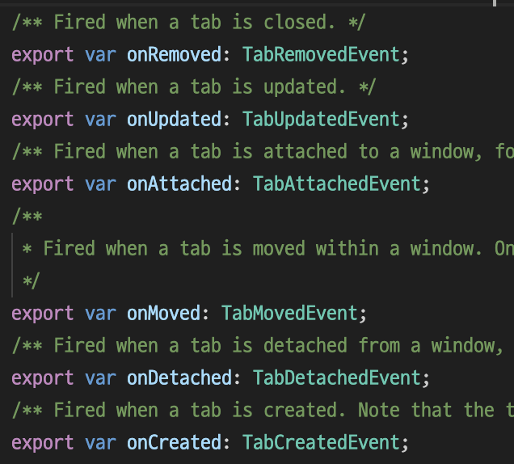
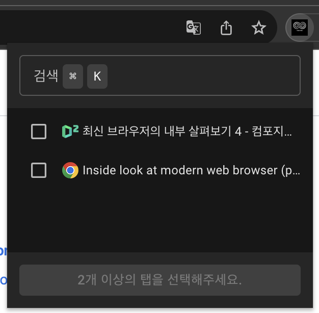

## 요구 사항

익스텐션의 기능을 먼저 정리해보겠습니다.

- 탭 정보 리스트
  - 열려 있는 탭을 체크 가능한 리스트 형태로 보여줘야 합니다.
  - 유저에게 제공되는 정보는 favicon과 title입니다.
  - newTab은 리스트에 보여주지 않습니다.
  - 정렬은 브라우저에서 탭이 열려있는 순서(index 오름차순)입니다.
  - 제목이 넘친다면 한 줄 말줄임 처리합니다.
  - 탭 제목 또는 URL로 검색할 수 있도록 합니다. (대략적으로 문자열 일치 파악)
- 동기화 시작
  - 2개 이상의 탭을 선택한 경우 시작할 수 있습니다.
  - 1개만 선택한 경우 버튼을 클릭할 수 없으며 가이드 메시지가 표시됩니다.
- 동기화 해제
  - 동기화 중인 탭 중 하나라도 제거되면 중지됩니다.
  - 동기화 중인 탭 중 URL이 변경되면 중지됩니다.
- 데이터 유지
  - 팝업을 껐다 켜도 데이터가 유지되어야 합니다.

## 기능 구현

### 탭 정보 리스트

탭의 `title`속성은 manifest에 tabs 권한이 포함된 경우에만 존재합니다. 따라서 manifest에 권한 설정이 필요합니다.

[chrome.tabs API](https://developer.chrome.com/docs/extensions/reference/tabs/#method-query) 를 이용해서 모든 탭의 정보들을 가져올 수 있습니다. newtab은 스크롤을 동기화하는 데 사용할 탭이 아니므로 제외하고 반환합니다.

```tsx
const useTabList = (queryInfo?: chrome.tabs.QueryInfo) => {
  return useQuery({
    queryKey: tabsKeys.list(queryInfo),
    queryFn: async () => {
      const tabs = await chrome.tabs.query(queryInfo ?? {});

      // Returns "tabs", excluding items with URL 'chrome://newtab/'.
      return tabs.filter((tab) => tab.url !== "chrome://newtab/");
    },
    suspense: true,
  });
};
```

참고로 탭이 생성, 업데이트, 삭제 되었을 때 함수를 실행하고 싶다면 아래 사진의 함수를 통해 가능합니다. 하지만 저의 목표는 원문과 번역문의 스크롤 위치를 동기화하기 원하는 저같은 사용자를 돕기 위함입니다. 따라서 이 함수들을 이용해 구현하는 경우는 없으므로 넘어가겠습니다.



사용 편의성을 위해 유저가 새 창을 띄우는 게 아닌, 간단한 **팝업**을 통해 이용할 수 있도록 하겠습니다. `useTabList` 를 통해 받아온 데이터를 이용해 `popup.html` 파일을 작성하면 아이콘을 눌렀을 때 나오는 팝업을 아래와 같이 구성할 수 있습니다.



그리고 탭이 많을 때 빠르게 찾을 수 있도록 **검색 기능**을 넣었습니다. 대략적인 문자열만 입력해도 결과를 찾을 수 있는 퍼지 검색(fuzzy-search) 알고리즘을 적용하기 위해 [Fuse.js](https://www.fusejs.io/)를 사용했습니다. 이로써 사용자가 단어 철자를 정확히 입력하지 않아도 원하는 검색 결과를 찾을 수 있습니다.

### 동기화 시작

선택한 탭 id를 받아 해당 탭에 스크롤 이벤트를 등록합니다. 그리고 스크롤이 감지되면 수치를 백분율로 나타내고 다른 탭을 그만큼 스크롤합니다. 이는 백그라운드 스크립트와 콘텐츠 스크립트를 활용하여 구현할 수 있습니다.

동기화를 시작할 수 없는 상황은 다음과 같습니다.

- 이미 동기화 중일 때
- 유저가 선택한 탭이 2개 미만일 때

선택된 탭이 2개 미만일 경우 또는 이미 동기화 중이라면 버튼을 `disabled` 처리하겠습니다.

### 동기화 해제

동기화가 해제되어야 하는 상황은 다음과 같습니다.

- 동기화 중일 때
- 동기화 중인 탭이 제거되었을 때
- 동기화 중인 탭의 URL이 변경되었을 때

### 데이터 유지

팝업을 껐다 켜도 데이터를 유지해야 합니다. 동기화를 시작했다면 팝업을 언제든 다시 켜도 어떤 탭이 동기화되고 있는지 유저에게 알려주기 위한 동작을 하기 위해선 말이죠.

이때 [chrome.storage API](https://developer.chrome.com/docs/extensions/reference/storage/) 를 활용해서 데이터 및 상태를 유지할 수 있습니다. 이 API를 사용하려면 tab처럼 manifest에 `storage` 권한을 설정해줘야 합니다.

백그라운드 스크립트에서 어떤 탭들이 동기화 중인지 저장하고 가져올 수 있는 함수를 만들어 사용하면 되겠습니다.

## 최적화

아래 코드는 스크롤 이벤트가 발생하면 scrollY의 %값을 `syncScroll` 커맨드와 함께 전달하는 함수입니다.

%값으로 적용한 이유는 똑같은 내용의 글을 번역한 것이어도 언어별로 전달하는 문자의 양이 차이가 납니다. 그러므로 스크롤한 값 그대로 적용하는 것보단 %값을 적용해 최대한 번역문과 원문 글의 문장을 비슷하게 읽어 내려갈 수 있게끔 하기 위함입니다.

```tsx
const onScrollHandler = () => {
  try {
    console.log("Scroll event triggered");

    const scrollPosition =
      window.scrollY || document.documentElement.scrollTop || document.body.scrollTop || 0;

    const scrollYPercentage = scrollPosition / document.documentElement.scrollHeight;

    console.log(
      "Scroll event triggered, sending syncScroll message with percentage:",
      scrollYPercentage,
    );

    chrome.runtime.sendMessage({
      command: "syncScroll",
      data: { scrollYPercentage },
    });
  } catch (err) {
    console.error(`Error in onScrollHandler: ${err}`);
  }
};
```

### Throttle 활용

위 함수를 스크롤 이벤트에 등록하고 실행을 해보면 아래 움짤처럼 굉장히 잦은 호출이 일어납니다.


저 함수의 목적은 스크롤이 발생하면 scrollY의 백분율 값을 계산해서 메시지를 보내는 것입니다. 그냥 자연스럽게 다른 탭도 함께 스크롤 될 수 있도록 하면 되기에 이 경우, `throttle` 을 활용해서 메시지를 적절한 타이밍에 보내도록 했습니다.

```tsx
const throttle = <Params extends any[]>(
  func: (...args: Params) => any,
  wait: number
): ((...args: Params) => void) => {
  let timer: ReturnType<typeof setTimeout> | undefined;

  return (...args: Params) => {
    if (timer) return;

    timer = setTimeout(() => {
      func(...args);
      timer = undefined;
    }, wait);
  };
};

const onScrollHandler = throttle(() => {
  ...
}, 100);
```


확실히 이제 호출이 자주 일어나지 않습니다. 하지만 움짤을 자세히 보면 또 다른 문제가 있는데요.

한쪽 탭을 스크롤하면 다른 탭도 스크롤 위치를 맞추기 위해 자동으로 스크롤 됩니다. 그럼 다른 탭에서도 스크롤이 발생하여 유저가 직접 스크롤하고 있는 탭(동기화 중인 탭)에 스크롤 위치를 맞추라는 메시지를 보내게 됩니다. 그렇게 아래 움짤처럼 서로 스크롤을 맞추기 위해 **무한 루프**에 빠지게 됩니다. (받는 쪽의 tabId를 보면 양쪽 모두 번갈아가며 스크롤 위치 데이터를 받고 스크롤 위치를 조정하고 있는 것을 확인할 수 있습니다.)

### Debounce 활용

이 문제를 개선하기 위해 선택한 탭들의 스크롤을 동일하게 맞추는 과정을 간단하게 살펴보겠습니다.

1. 유저가 서로 스크롤이 동기화되기 원하는 탭들을 선택하면 `startSync` 커맨드와 함께 탭의 id를 배열 형태로 전달합니다.
2. 받은 탭의 id를 기반으로 해당 탭에 `startSyncTab` 커맨드를 전달합니다.
3. `startSyncTab` 을 전달 받으면 스크롤이 발생했을 때 scrollY의 퍼센트값을 계산해서 `syncScroll` 커맨드를 보내는 함수(onScrollHandler)를 등록합니다.
4. `syncScroll` 을 전달 받으면 현재 스크롤 중인 탭을 제외하고 동기화 중인 모든 탭에 `syncScrollForTab` 커맨드와 함께 scrollYPercentage 값을 전달합니다.
5. `syncScrollForTab` 을 전달 받으면 `window.scrollTo()` 함수를 사용해 원하는 위치로 스크롤합니다.

위 과정들을 거쳐 각 탭의 스크롤이 동기화 됩니다.

이 문제는 **사용자의 스크롤**과 `**window.scrollTo()` 함수를 이용해 동작하는 스크롤\*\*을 구별하는 플래그 역할을 하는 변수와 `debounce` 함수를 통해 개선할 수 있습니다. 천천히 개선하는 과정을 구현해보겠습니다.

먼저, 플래그 역할을 하는 `scrolling` 변수를 선언하고 `false` 로 초기화하겠습니다.

```tsx
let scrolling = false;
```

`syncScrollForTab` 을 전달 받으면 스크롤 위치를 동기화하는데 여기서 `scrolling: true` 로 설정하겠습니다. 그리고 스크롤 이벤트에 등록한 함수에 `scrolling: true` 라면 메시지를 보내지 않도록 하겠습니다.

```tsx
const onScrollHandler = throttle(() => {
  if (scrolling) return;
  ...
}, 100);

if (request.command === "syncScrollForTab") {
  scrolling = true;
  console.debug("Received syncScrollForTab message with data", request.data);

  const { scrollYPercentage } = request.data;
  const scrollPosition =
    scrollYPercentage * document.documentElement.scrollHeight;

  window.scrollTo({
    top: scrollPosition,
    behavior: "auto",
  });
}
```

마지막으로 `scrolling: false` 로 변경하는데 이 부분에 `debounce` 를 적용합니다.

```tsx
const debounce = <Params extends any[]>(
  func: (...args: Params) => any,
  wait: number
): ((...args: Params) => void) => {
  let timer: ReturnType<typeof setTimeout> | undefined;

  return (...args: Params) => {
    clearTimeout(timer);
    timer = setTimeout(() => {
      func(...args);
    }, wait);
  };
};

const resetScrolling = debounce(() => {
  scrolling = false;
  console.debug("Scrolling reset to", scrolling);
}, 250);

if (request.command === "syncScrollForTab") {
  scrolling = true;
  ...
  resetScrolling();
}
```

이제 스크롤 이벤트가 발생하게 되면 아래처럼 실행됩니다.

스크롤 이벤트가 발생 → `syncScroll` 커맨드를 받아 동기화 중인 모든 탭에 `syncScrollForTab` 커맨드와 함께 scrollYPercentage 값을 전달 → `scrolling: true` 로 설정 및 스크롤 위치 조정 후 `resetScrolling` 함수 실행 → 스크롤 이벤트 발생 → `scrolling` 이 true이므로 동작 생략

움짤로 확인해보겠습니다.


1 id를 가진 탭에서 메시지를 보내면 2 id를 가진 탭이 메시지를 받아 `window.scrollTo()` 함수를 이용해 스크롤 위치를 동기화합니다. 반대로 2 id를 가진 탭이 메시지를 보내면 1 id를 가진 탭에서 메시지를 받아 스크롤 위치를 동기화하는 것을 볼 수 있습니다.

스크롤 위치도 자연스럽게 동기화 되고 문제가 개선되었습니다.

## ‘Uncaught (in promise) Error: Could not establish connection. Receiving end does not exist.’ 오류 해결

### 오류 발견

처음 기획 했던 대로 기본 기능을 모두 구현했습니다. 그러나 콘솔에서 예기치 않은 오류가 발생합니다. 디버깅을 위해 앱을 설치하고 열려있던 탭을 선택 후 동기화 시작 버튼을 누르면 에러가 발생합니다. 그리고 탭 간 스크롤이 동기화되지 않습니다.

```bash
Uncaught (in promise) Error: Could not establish connection. Receiving end does not exist.
```

### 이 오류가 발생하는 이유?

이 오류는 일반적으로 백그라운드 스크립트에서 `chrome.tabs.sendMessage`메서드가 호출될 때 콘텐츠 스크립트가 탭에 **수신되지 않거나 아직 초기화되지 않은** 경우에 나타납니다.

특히 [Chromium-dev 그룹에 올라온 대화](https://groups.google.com/a/chromium.org/g/chromium-extensions/c/BH5_4OKxM3s/m/7lqiiKT9AQAJ)에서 해당 문제에 대해 명확히 파악할 수 있습니다.

> Content scripts declared in manifest.json or registered in chrome.scripting.registerContentScripts run only when the tab is loaded or reloaded (e.g. via Ctrl-R), so when you install or update your extension the existing tabs don't run your new content scripts automatically in Chrome (they do in Firefox though), whereas the old content scripts that were running previously lose the ability to connect to the extension.

쉽게 설명하면 콘텐츠 스크립트를 등록하는 `chrome.scripting.registerContentScripts`는 새로고침 또는 탭이 로드될 때만 실행됩니다. 따라서 익스텐션을 설치하기 전인 이전 탭에는 수동으로 콘텐츠 스크립트를 등록하지 않으면 서로 메시지를 주고 받을 수 없다는 것입니다.

위 설명에 따르면 익스텐션을 설치하기 전에 존재하던 탭에는 콘텐츠 스크립트가 실행되지 않습니다. 이러한 탭으로 메시지를 보내려고 할 때 수신단(콘텐츠 스크립트)이 없으므로 오류가 발생한 것이죠.

### 이 오류를 어떻게 해결할 수 있을까?

핵심은 메시지를 보내려는 탭에 콘텐츠 스크립트가 삽입되어 있어야 하는 것입니다. 콘텐츠 스크립트를 삽입하는 방법은 아래 3가지 방법이 있겠네요.

1. 설치 전 열려있던 탭을 강제로 새로고침하여 콘텐츠 스크립트를 삽입합니다.
2. 익스텐션 설치 시, 콘텐츠 스크립트를 기존 탭에 삽입합니다.
3. 콘텐츠 스크립트가 필요한 작업 요청 시 콘텐츠 스크립트를 삽입합니다.

제 생각엔 세 번째 방법이 적절할 것 같습니다. 첫 번째 방법은 사용자의 데이터가 유실될 위험이 있습니다. 두 번째 방법은 설치하기 전에 존재했던 모든 페이지에 콘텐츠 스크립트를 적용하게 됩니다. 어차피 사용자가 원하는 탭에 콘텐츠 스크립트를 삽입해서 메시지를 주고 받으면 됩니다. 따라서 필요한 탭에 콘텐츠 스크립트를 삽입하는 세 번째 방법을 선택했습니다.

### 구현

1. `chrome.tabs.sendMessage`를 사용하여 메시지를 보내기 전에 `chrome.scripting.executeScript`를 사용해 콘텐츠 스크립트를 유저가 선택한 탭에 삽입합니다.
2. 스크립트 삽입이 성공하면 메시지를 계속 전송할 수 있게 됩니다.

간단한 코드로 살펴보겠습니다.

```tsx
// background.ts

chrome.runtime.onMessage.addListener((message, sender, sendResponse) => {
  // Popup에서 'startSync' 커맨드와 함께 유저가 선택한 탭의 id들을 전달하면 여기서 받습니다.
  if (message.command === "startSync") {
    const checkedTabIds: number[] = request.data;

    checkedTabIds.forEach((tabId) => {
      // 탭이 존재하고 접근 가능한지 확인합니다.
      chrome.tabs.get(tabId, () => {
        if (chrome.runtime.lastError) {
          console.error(
            `Error in chrome.tabs.get: ${chrome.runtime.lastError}`
          );
          return;
        }

        // 콘텐츠 스크립트를 해당 탭에 삽입합니다.
        chrome.scripting.executeScript(
          {
            target: { tabId },
            files: ["src/pages/content/index.js"],
          },
          () => {
            if (chrome.runtime.lastError) {
              console.error(
                `Error in chrome.scripting.executeScript: ${chrome.runtime.lastError.message}`
              );
              return;
            }

            // 주입이 성공하면 메시지를 보냅니다.
            chrome.tabs.sendMessage(tabId, {
              command: "startSyncTab",
              data: tabId,
            });
          }
        );
      });
    });
  }
}
```

그리고 scripting을 사용한다고 manifest의 permissions에 포함하면 됩니다.

이렇게 유저가 선택한 탭에 메시지를 보내기 전에 콘텐츠 스크립트를 삽입함으로써 발생한 오류를 해결할 수 있었습니다.

## 다국어 지원

다국어를 지원하는 방법은 아주 간단합니다.

로케일을 추가할 때마다 `_locales/_localeCode_` 폴더 아래에 `messages.json` 파일에 문자열을 작성하면 됩니다. 여기서 `localeCode`는 영어의 `en`과 같은 국가코드입니다.

```json
{
  "extName": {
    "message": "Synchronize Tab Scrolling - 여러 탭의 스크롤 위치를 동일하게 유지"
  },
  "extDescription": {
    "message": "여러 탭을 선택하고 스크롤 위치를 동기화할 수 있습니다."
  },
  "startSync": {
    "message": "동기화 시작"
  }
}
```

`manifest.json` 에선 `__MSG_messagename__` 처럼 문자열을 작성해 적용할 수 있습니다.

```json
{
  "name": "__MSG_extName__"
}
```

위 `messages.json` 파일의 메시지를 간편하게 사용하기 위한 함수를 작성합니다.

```tsx
import type EnMessage from "../../public/_locales/en/messages.json";
import type KoMessage from "../../public/_locales/ko/messages.json";

type MessageKey = keyof typeof EnMessage | keyof typeof KoMessage;

export const t = (key: MessageKey) => chrome.i18n.getMessage(key);
```

en, ko 메시지들을 가져와 문자열로 보여줍니다. 아래는 사용 예시입니다.

```tsx
import { t } from "@src/chrome/i18n";

const Popup = () => {
  ...
  return (
    <div>{t("startSync")}</div>
  )
}
```

나머지 정보들은 [developer.chrome: how-to-support-multiple-languages](https://developer.chrome.com/docs/extensions/reference/i18n/#how-to-support-multiple-languages) 에서 자세히 확인하실 수 있습니다.
