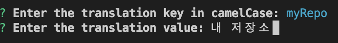
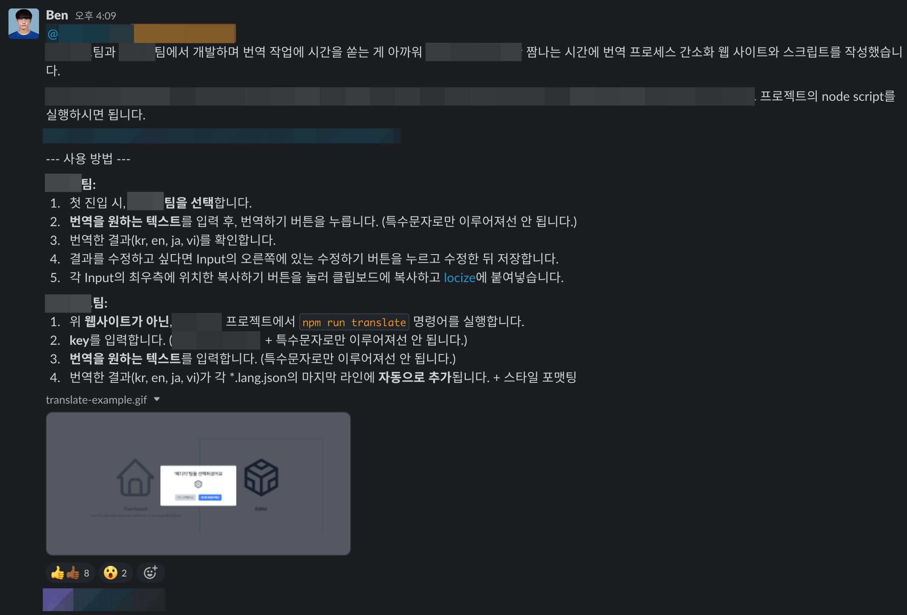

## 새로운 팀에 합류한 이후 했던 것 중 가장 비효율적인 업무

### 너무나도 번거로운 번역 작업

새로 합류한 팀의 프로젝트에서는 총 4개 국어(한국어, 영어, 일본어, 베트남어)를 지원해야 했습니다.
`ko.lang.json` 또는 `en.lang.json` 이런식으로 이름을 짖고 `json` 파일 형식으로 관리하고 있었습니다.

따로 번역 작업을 해주시는 분은 없고, 그냥 구글 번역기를 통해 얻은 값을 각 `json` 파일에 추가해서 다
국어를 지원하고 있었죠.

로직을 작성해나가며 하나하나 번역기를 돌리고 각 `json` 파일에 추가하는 작업은 보통 귀찮은 작업이 아
니었습니다.

### 손수 작업의 한계

일일이 번역할 문구를 복사해 4개 국어로 번역하고, 번역된 문구를 다시 각각 복사해 4개의 `json` 파일에
추가하는 과정이 필요합니다. 또한 여러 개발자가 작업하다보니 `key` 네이밍 문법도 정리가 안 되어 있었
습니다. 어떤 것은 `camelCase`, 또 어떤 것은 `snake_case`로 되어 있었습니다. 워낙 바쁘다보면
`en.lang.json` 파일에 한국어를 추가하는 실수를 범할 수도 있겠죠. 이 과정에서 많은 시간이 소모되고 실
수를 하지 않는다는 보장이 없죠.

이런 새로운 기능을 작업할때마다 반복되다 보니 어느 세월에 문구를 복사해서 변역하고 또 번역한 값을 복
사해서 각 언어 파일에 키값과 함께 추가하고 로직은 언제 다 구현하지? 라는 마음이 들었습니다. 이 과정
을 개선하기로 마음 먹었죠.

### 어차피 번역기를 사용해서 할거라면 스크립트를 작성해서 개선할 수 있지 않을까?

구글 번역기를 사용하므로 google에서 제공하는 번역 API를 이용해 한 번에 4개의 언어로 번역해주고 파일
에 자동으로 추가해주는 스크립트를 도입하여 번역 업무의 비효율성을 개선할 수 있을 것 같았습니다.

개발자가 번역할 문구와 키값을 입력하면 자동으로 4개 국어로 번역해주고 매칭되는 언어별 `json` 파일의
마지막 줄에 추가해주는 방법이 좋을 것 같습니다. 또한 key 값도 입력받을 때 정해둔 네이밍 문법에 일치
해야 하기 때문에 통일되는 이점도 동시에 따라 왔죠. 여기서 네이밍 문법은 애초에 정해져 있지 않았기 때
문에 팀원분들께 미팅 요청을 드렸고 `camelCase`로 통일하기로 결정이 되었죠. 그리고 번역 값이 100프로
정확할 순 없으니 번역 결과값을 받아 수정할 수 있도록 하면 더욱 좋겠죠.

이제 생각한 것을 편하게 사용할 수 있도록 구현하면 되겠습니다.

## 모든 팀들이 편하게 사용하도록 웹 사이트로 만들자

‘위 스크립트를 만들어도 어떻게 해야 팀원들이 쉽게 사용할 수 있을까?‘라는 고민이 들었습니다. 익숙한웹
사이트에서 최대한 직관적이고 간단하게 구현해 각 팀별로 원하는 목적을 쉽게 달성할 수 있도록 구현하고
싶었습니다. 다른 팀에서도 `json` 파일을 사용하진 않지만 구글 번역기를 이용해서 4개 국어를 지원하고
있었기 때문에 이왕 만드는 거 다른 팀원분에게도 도움이 되고 싶었기 때문에 첫 진입 시, 팀을 선택하고
각 팀별로 다른 화면을 보여주도록 플로우를 그렸죠.

예로 A라는 팀에서는 [locize](https://locize.com/)라는 번역 관리 시스템을 사용해서 관리 중이었습니다.
locize를 사용하면 번역할 문구를 언어별로 locize에 붙여넣으면 됩니다. 따라서 `json` 파일을 사용하지않
으므로 4개 국어로 번역하고 각 번역 값을 확인 후, 수정하고 복사할 수 있도록 하면 좋겠죠.

제가 속해 있는 B 팀의 경우에는 번역한 값들을 각 언어별 `json` 파일에 key-value 형식으로 추가해줘야합
니다. 따라서 key와 value를 입력받고 각 `json` 파일에 추가해주면 많이 편해질 겁니다.

아래는 구현한 웹사이트에서 각 팀별로 번역 작업을 하는 1차 결과입니다.

### TeamA


- TeamA (`locize` 를 사용하는 팀)
  - 첫 진입 시, TeamA를 선택합니다.
  - 번역할 텍스트를 입력 후, 번역 실행 버튼을 누릅니다. (특수문자로만 이루어져서는 안 됩니다.)
  - 번역한 결과를 확인합니다.
    - 결과를 수정하고 싶다면 `input`의 오른쪽에 있는 수정하기 아이콘을 눌러 수정한 뒤 저장합니다.
  - 복사하기 버튼을 눌러 클립보드에 복사하고 `locize` 에 붙여넣습니다.

### TeamB


- TeamB (`json` 파일을 사용하는 팀)
  - 첫 진입 시, TeamB를 선택합니다.
  - 언어 파일이 위치한 폴더의 경로를 입력하지 않았었다면, 파일의 경로를 입력합니다.
    - 입력한 경로에 `language.json` 파일이 존재하지 않는다면 저장되지 않습니다.
  - `json` 파일에 추가할 텍스트를 입력합니다.
    - key를 입력합니다. (camelCase 형식이어야 하며, 특수문자로만 이루어져선 안 됩니다.)
    - 번역할 텍스트를 입력 후, 번역 실행 버튼을 누릅니다.
  - 번역한 결과를 확인합니다.
    - 결과를 수정하고 싶다면 `input`의 오른쪽에 있는 수정하기 아이콘을 눌러 수정한 뒤 저장합니다.
  - ‘각 언어별 json 파일에 저장’ 버튼을 눌러 각 `json` 파일에 추가합니다.

일단 생각한대로 구현은 했습니다. `locize` 를 사용하는 TeamA의 경우에는 번역 작업이 편해진 것 같습니
다. 하지만 `json` 파일을 사용하는 TeamB의 경우에는 번역 작업을 하려면 여전히 번거롭다고 느껴졌습니다
. 번역 작업을 편하게 하기 위해 웹 사이트 주소를 알아야 하는 것은 물론, 팀을 선택하고 언어 파일 경로
를 설정해야 했죠.

## 차라리 노드 스크립트로 만들어 더욱 편하게 사용하자

언어 파일 경로를 설정하는 과정조차 없애고 싶었습니다. 그래서 TeamB의 경우에는 이 웹 사이트가 아닌,
프로젝트에서 node script를 실행해 번역 작업을 더 간편하게 할 수 있게 방식을 변경하기로 결정했습니다.
이렇게 하면 웹사이트의 주소를 알지 않아도 되고 필요한 기능만 명확히 수행할 것 같았습니다.

간단하게 스크립트를 만들어 보겠습니다.

먼저, 사용자에게서 터미널에서 key와 value를 입력받아야 합니다. 이 정보들을 입력받기 위해
[inquirer.js](https://www.npmjs.com/package/inquirer) 라이브러리를 사용하겠습니다. `inquirer.js` 는
터미널에서 다양한 UI로 사용자의 입력을 받거나, 출력해주는 라이브러리입니다. 아래 사진을 보시면 어떤
느낌인지 감이 잡히실 겁니다.



### 흐름 정리하기

1. 번역할 국가별 `언어 코드` 및 언어별 `json` 파일이 존재하는 폴더 경로를 정의합니다.
2. 사용자로부터 `key`를 입력받습니다.
   1. 값을 입력하지 않거나, 이미 존재하는 `key` 라면 오류 메시지를 반환하고 다시 입력 받습니다.
   2. `camelCase` 가 아니라면 오류 메시지를 반환하고 다시 입력받습니다.
3. 사용자로부터 `value` 를 입력받습니다.
   1. 값을 입력하지 않으면 오류 메시지를 반환하고 다시 입력받습니다.
4. 각 언어 파일에 `key-value`를 추가합니다.
   1. 입력받은 `value`를 4개 국어로 번역합니다.
   2. 정의해두었던 `json`파일이 존재하는 폴더 경로를 이용해, 해당 폴더의 하위에 존재하는 모든 언어파
      일들을 가져옵니다. 없다면 오류 메시지를 반환합니다.
   3. 찾은 각 `json` 파일의 문자열을 분석하고, JS 객체로 변환합니다.
   4. 변환한 JS 객체에 전달 받은 `key` 와 번역된 `value`를 추가합니다.
   5. 변경된 JS 객체를 다시 JSON 문자열로 변환해 각 언어 파일에 작성합니다.
5. 결과를 터미널에 출력합니다.

정리하고 보니 빠르게 스크립트를 구현할 수 있을 것 같네요. 바로 코드로 구현해보겠습니다.

### 번역할 국가별 `언어 코드` 및 언어별 `json` 파일이 존재하는 폴더 경로 정의하기

```jsx
// 정의한 언어 코드를 이용해 번역을 진행합니다.
const LANGUAGE_CODE = ['ko', 'en', 'ja', 'vi'];
// 언어별 json 파일이 존재하는 폴더 경로를 정의합니다.
const LANGUAGES_DIR_PATH = path.join(process.cwd(), 'libs', 'locales', 'languages');
```

### 사용자로부터 `key`와 `value`를 입력받기

```jsx
// 각 json 파일에 전달된 키가 존재하는지 검증합니다.
const keyExistsInLangFiles = (key) => {
  for (const languageCode of LANGUAGE_CODE) {
    const convertedLanguageCode = convertLanguageCode(languageCode);

    const languageFile = path.join(LANGUAGES_DIR_PATH, `${convertedLanguageCode}.lang.json`);
    if (fs.existsSync(languageFile)) {
      const languageContent = JSON.parse(fs.readFileSync(languageFile));
      if (languageContent[key] !== undefined) {
        console.log(
          chalk.red(`The key '${key}' already exists in '${convertedLanguageCode}.lang.json'.`),
        );
        return true;
      }
    }
  }
  return false;
};

const isNil = (value) => {
  return value === null || value === undefined;
};

const isEmptyString = (value) => {
  return isNil(value) || value?.toString().trim() === '';
};

// 사용자에게 key와 value 값을 입력하라는 메시지를 표시합니다.
const promptTranslation = async () => {
  let key = '';
  while (isEmptyString(key) || keyExistsInLangFiles(key)) {
    const { key: inputKey } = await inquirer.prompt([
      {
        type: 'input',
        name: 'key',
        message: 'Enter the translation key in camelCase:',
        validate: validateCamelCase,
      },
    ]);
    key = inputKey;
  }

  const { value } = await inquirer.prompt([
    {
      type: 'input',
      name: 'value',
      message: 'Enter the translation value:',
      validate: (input) => {
        if (isEmptyString(input)) {
          return 'value cannot be empty. Please enter again:';
        }
        return true;
      },
    },
  ]);

  return { key, value };
};
```

`inquirer` 라이브러리를 활용해 입력받도록 합니다. `type` 속성은 프롬프트의 유형을 정의합니다. input
type은 사용자에게서 문자열을 입력 받습니다. 그리고 `validate` 속성을 통해 사용자의 input 값에 제약을
걸어줍니다.

### 각 언어 파일에 `key-value`를 추가하기

```jsx
// 입력 받은 값을 번역하고 번역된 값을 반환합니다.
const translateText = async (text, targetLanguage) => {
  const response = await axios.post(
    'https://translation.googleapis.com/language/translate/v2',
    {
      q: text,
      target: targetLanguage,
    },
    {
      params: {
        key: GOOGLE_TRANSLATE_API_KEY,
      },
    },
  );
  return response.data.data.translations[0].translatedText;
};

// 전달받은 언어 코드에 해당하는 json 언어 파일을 찾아서 반환합니다.
const findLanguageFile = async (languageCode) => {
  // `recursive-readdir` 라이브러리에서 제공하는 함수입니다.
  // 해당 하위 디렉터리의 모든 파일을 재귀적으로 나열합니다.
  const files = await recursive(LANGUAGES_DIR_PATH);
  const languageFile = files.find(
    (file) => path.basename(file) === `${convertLanguageCode(languageCode)}.lang.json`,
  );
  if (!languageFile) {
    throw new Error(`Language file for ${convertLanguageCode(languageCode)} not found.`);
  }
  return languageFile;
};

// 각 언어 파일에 키와 번역 값을 추가합니다.
const addTranslation = async (key, value) => {
  const translations = {};
  for (const languageCode of LANGUAGE_CODE) {
    const translatedValue = await translateText(value, languageCode);
    const languageFile = await findLanguageFile(languageCode);
    const languageContent = JSON.parse(fs.readFileSync(languageFile));
    languageContent[key] = translatedValue;
    fs.writeFileSync(languageFile, JSON.stringify(languageContent, null, 2));
    translations[languageCode] = translatedValue;
  }
  return translations;
};
```

### 전체 번역 프로세스 실행하기

```jsx
// 전체 번역 프로세스를 실행합니다.
const translate = async () => {
  try {
    const { key, value } = await promptTranslation();
    const translations = await addTranslation(key, value);
    console.log(chalk.green('번역 결과: ', JSON.stringify(translations, null, 2)));
    console.log(
      chalk.green(`Translation added to ${convertLanguageCode(LANGUAGE_CODE)}.lang.json`),
    );
  } catch (error) {
    console.error(chalk.red(error.message));
  }
};

translate();
```

이렇게 구현한 스크립트를 실행해보겠습니다. 아래는 스크립트 실행 결과입니다.


- `npm run translate` 명령어를 실행합니다.
- key를 입력합니다. (camelCase 형식이어야 하며, 특수문자로만 이루어져선 안 됩니다.)
- 번역을 원하는 텍스트를 입력 후, 엔터를 누릅니다.
- 번역한 결과가 각 `json` 파일의 마지막 라인에 자동으로 추가되며 포맷팅을 실행합니다.

## 마무리



작업 이후 좋은 반응과 함께 번거롭던 번역 작업이 편해졌다는 의견이 많았습니다. 여러 고민을 거쳐 만든
보람이 있었죠. 이렇게 스크립트를 도입하여 번역 업무의 비효율성을 개선할 수 있었습니다. 이제 번역 업
무에서 발생하는 시간을 크게 줄일 수 있게 되었습니다.

## 참고

- [https://nodejs.org/api/fs.html](https://nodejs.org/api/fs.html)
- [https://fe-developers.kakaoent.com/2022/220929-workflow-dispatch-with-inquirer-js/](https://fe-developers.kakaoent.com/2022/220929-workflow-dispatch-with-inquirer-js/)
