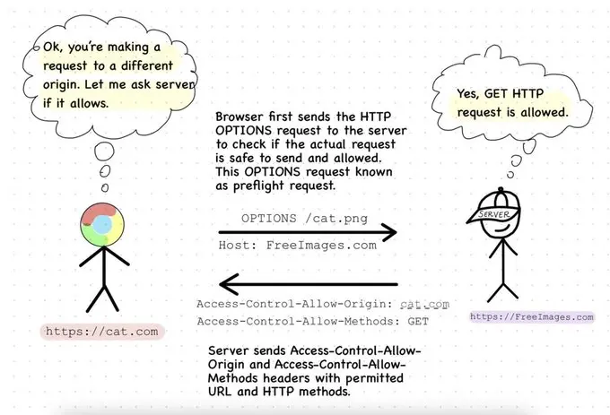

HTTP 요청 메서드는 아래처럼 [MDN](https://developer.mozilla.org/ko/docs/Web/HTTP/Methods)에 정의되어 있습니다:

> HTTP는 **요청 메서드**를 정의하여, 주어진 리소스에 수행하길 원하는 행동을 나타냅니다.

HTTP 메서드는 세 가지 속성을 기준으로 판단할 수 있습니다:

1. [Safe](https://developer.mozilla.org/en-US/docs/Glossary/Safe) - 서버 상태에 영향을 미치지 않는 경우
2. [Idempotent](https://developer.mozilla.org/en-US/docs/Glossary/Idempotent)(멱등성) - API 호출 횟수에 상관없이 결과가 동일하게 유지되는 경우
3. [Cacheable](https://developer.mozilla.org/en-US/docs/Glossary/Cacheable) - 응답을 캐시할 수 있는 경우

## 1. GET

서버에서 원하는 리소스를 요청할 때 사용되며 서버 상태에는 영향을 주지 않습니다.

✅ Safe

✅ Idempotent

✅ Cacheable

## 2. POST

GET 요청과 완전히 반대인 메서드입니다.

서버에 데이터를 제출하는 데 사용되므로 서버 상태를 변경합니다.

❌ Safe

❌ Idempotent

❗ Cacheable

> 💡 **POST 메서드의 캐싱** POST 메서드에 대한 응답은 신선도 수명(적절한 Cache-Control 또는 Expires response header 필드)을 포함한 경우에만 캐시할 수 있습니다. [RFC7234#section-4.2.1](https://www.rfc-editor.org/rfc/rfc7234#section-4.2.1)절에서 신선도 수명을 계산하는 방법에 대해 명시적으로 설명하고 있습니다. 어떻게 의미 있는 캐싱을 허용할 수 있을지는 [RFC7231#section-4.3.3](https://www.rfc-editor.org/rfc/rfc7231#section-4.3.3)절에서 명확히 설명하고 있습니다.

## 3. PUT

리소스를 완전히 업데이트하거나 대체할 때 사용됩니다.

요청 URI가 이미 존재하는 리소스를 가리키는 경우: 원본 서버의 리소스를 변경

요청 URI가 존재하지 않는 리소스를 가리키는 경우: 해당 URI로 리소스를 생성합니다(사용자가 해당 URI를 새 리소스로 정의할 수 있는 경우라 가정).

❌ Safe

✅ Idempotent

❌ Cacheable

## 4. PATCH

리소스 중 원하는 부분만 업데이트할 때 사용됩니다.

❌ Safe

❌ Idempotent

❌ Cacheable

> 💡 PUT과 PATCH의 차이점과 PATCH 메서드가 멱등성을 지니지 않는 이유에 대해 궁금하다면 [PUT과 PATCH의 차이점과 멱등성](https://lazy-dev.netlify.app/http_method/difference-between-put-patch) 글을 참고해주세요

## 5. DELETE

서버에서 데이터를 삭제할 때 사용됩니다.

❌ Safe

✅ Idempotent

❌ Cacheable

## 6. HEAD

GET과 유사하지만 실제 `body` 컨텐츠를 가져오지 않고 리소스의 헤더만 요청합니다.

✅ Safe

✅ Idempotent

✅ Cacheable

## 7. OPTIONS

대상 리소스에 사용할 수 있는 통신 옵션에 대한 정보를 요청하는 데 사용됩니다.

응답으로 리소스에서 허용되는 **HTTP 메서드를 나타내는 허용 헤더** 또는 **다양한 교차 출처 리소스 공유 헤더**가 포함될 수 있습니다. 아래 이미지가 이를 잘 설명합니다.

✅ Safe

✅ Idempotent

❌ Cacheable

## 8. CONNECT

프록시 서버를 통해 실제 서버로 TCP 연결을 요청합니다.

중개 프록시 서버를 통해 클라이언트와 서버 간의 보안 통신을 설정하기 위해 TLS(https)를 사용하는 웹사이트에 액세스하는 데 사용됩니다.

❌ Safe

❌ Idempotent

❌ Cacheable

## 9. TRACE

디버깅에 유용한 메서드입니다.

TRACE 요청이 전송되면 서버는 수신된 요청을 클라이언트에 반영하여 프록시 또는 게이트웨이를 통과할 때 변경된 내용을 확인할 수 있습니다(웹 서버는 수신된 정확한 요청을 응답에 반영하여 응답합니다).

주의할 점으로, 클라이언트는 요청에 콘텐츠를 보내거나 저장된 사용자 자격 증명 또는 쿠키와 같은 민감한 데이터를 포함할 수 있는 필드를 생성해서는 안 됩니다.

✅ Safe

✅ Idempotent

❌ Cacheable

## 참고

- https://developer.mozilla.org/en-US/docs/Web/HTTP/Methods
- https://stackoverflow.com/questions/626057/is-it-possible-to-cache-post-methods-in-http
