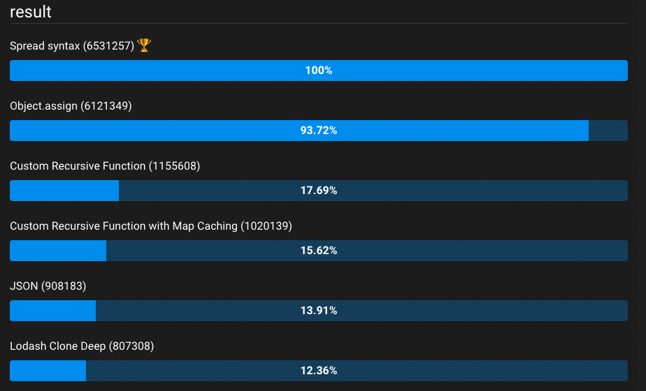

## 객체 복사하기

객체를 복사하는 데 주로 쓰이는 방법은 아래와 같습니다.

| 방법                                                                                                | 단점                                                                                                |
| --------------------------------------------------------------------------------------------------- | --------------------------------------------------------------------------------------------------- |
| JSON.stringify() & JSON.parse()                                                                     | Infinity, Functions, Date, RegExp 등의 유형은 유실됩니다.                                           |
| Spread syntax                                                                                       | 중첩된 객체는 깊게 복사하지 못합니다                                                                |
| Object.assign()                                                                                     | 중첩된 객체는 깊게 복사하지 못합니다                                                                |
| Recursive Deep Copy                                                                                 | 순환 참조가 있는 객체를 받을 경우 무한 루프에 빠지게 됩니다.                                        |
| 직접 작성한 함수이므로 객체(ArrayBuffer, DataView…)복사 로직 직접 구현 및 다양한 테스트 필요합니다. |
| Recursive Deep Clone with WeakMap Caching                                                           | 직접 작성한 함수이므로 객체(ArrayBuffer, DataView…)복사 로직 직접 구현 및 다양한 테스트 필요합니다. |
| Lodash - cloneDeep()                                                                                | 외부 종속성이 추가됩니다                                                                            |

각 함수를 테스트하기에 앞서 `person` 이라는 객체를 생성해두겠습니다. 앞으로 이 객체를 이용하여 모든
함수 테스트를 진행할 것입니다.

### Set Person Object

```tsx
const person = {
  name: 'ben',
  age: 20,
  address: {
    city: 'seoul',
    country: 'korea',
  },
  getAge: function () {
    return this.age;
  },
  birth: new Date(),
  life: Infinity,
  regT: /^[a-z0-9](\.|\+|\-?[a-z0-9]){1,39}@test\.com$/gm,
};
```

### JSON.stringify() & JSON.parse()

`JSON.stringify` 함수가 객체를 JSON 문자열로 변환합니다. (원본 객체에 대한 참조가 없어집니다) 그리고
`JSON.parse` 를 이용해 객체를 반환합니다.

이렇게 이 두 가지 함수를 이용하여 간단하게 객체의 깊은 복사본을 만들 수 있습니다. 이제 복사된 객체가
변경되어도 원본 객체는 그대로 유지됩니다.

```tsx
const deepCopyObj = <T extends Record<string, any>>(obj: T): T => {
  return JSON.parse(JSON.stringify(obj));
};

const deepCopyPerson = deepCopyObj(person);

console.log(person === deepCopyPerson);
// => false

deepCopyPerson.name = 'tony';
console.log(person.name);
// => 'ben'
console.log(deepCopyPerson.name);
// => 'tony'

deepCopyPerson.address.city = 'busan';
console.log(person.address.city);
// => 'seoul'
console.log(deepCopyPerson.address.city);
// => 'busan'
```

이 방법을 사용할 때 꼭 알아둬야 할 사항들이 있습니다. `ArrayBuffer`, `Map`, `Set`, `RegExp`, `Date`
`functions`, `RegExp`, `Date` 객체, `Infinity` 까지 복사하진 않습니다. 왜 그럴까요?

- `Date` 객체는 JSON으로 변환하는 과정에서 [ISO 8601](https://en.wikipedia.org/wiki/ISO_8601)형식에
  따라 문자열로
  [저장](https://stackoverflow.com/questions/10286204/what-is-the-right-json-date-format)됩니다. 따
  라서 원본 객체의 `Date` 객체는 **복사 후 손실**됩니다. `reviver` 기능을 사용하면 `Date` 객체를
  [가져올 수 있긴 합니다](https://stackoverflow.com/a/9194413).
- 함수는 데이터가 아니라 더 복잡한 의미를 가진 동작이며 JSON에서 지원되는 엔티티가 아니기 때문에
  **복사 후 함수는 유지되지 않습니다**.
- JSON에서 객체를 직렬화하고 역직렬화하는 방법의 특성으로 인해 **느릴 것 같지만** 대부분의 사람들이
  이 방식을 채택하여 사용하여
  [V8이 적극적으로 최적화](https://v8.dev/blog/cost-of-javascript-2019#json)했기에 **빠르게** 복사본
  을 얻을 수 있습니다.

즉, 복사된 객체에서 아래와 같이 데이터를 사용하려 한다면 예와 에러가 발생합니다.

```tsx
deepCopyPerson.getAge();
// => TypeError: deepCopyPerson.getAge is not a function
deepCopyPerson.birth.getDate();
// => TypeError: deepCopyPerson.birth.getDate is not a function
deepCopyPerson.life;
// => null
```

따라서 이 방법은 객체 내에 위와 같은 데이터가 없을 경우에 사용하면 됩니다.

### Spread syntax

```tsx
const copyObj = <T extends Record<string, any>>(obj: T): T => {
  return { ...obj };
};

const copyPerson = copyObj(person);

console.log(person === copyPerson);
// => false
```

### Object.assign()

```tsx
const copyObj = <T extends Record<string, any>>(obj: T): T => {
  return Object.assign({}, obj);
};

const copyPerson = copyObj(person);

console.log(person === copyPerson);
// => false
```

`Spead` 연산자나 `Object.assign` 은 최상위 속성을 복사합니다. 하지만 객체로서의 속성은 얕은 복사 후
에 참조로 복사되므로 원본 객체와 복사된 객체 간에 공유됩니다. MDN 참고:
[https://developer.mozilla.org/en-US/docs/Web/JavaScript/Reference/Global_Objects/Object/assign#warning_for_deep_clone](https://developer.mozilla.org/en-US/docs/Web/JavaScript/Reference/Global_Objects/Object/assign#warning_for_deep_clone)
쉽게 아래 코드로 예시를 들어보겠습니다.

```tsx
// 중첩된 객체를 포함하는 복잡한 person 객체 전달
// 중첩된 객체 내의 속성을 변경할 때마다 원본 객체인 person의 동일한 속성도 변합니다
const copiedPerson = Object.assign({}, person);

copiedPerson.name = 'tony';
copiedPerson.address.city = 'busan';

console.log(person.name, copiedPerson.name);
// => 'tony', 'ben'
console.log(person.address.city, copiedPerson.address.city);
// => 'busan', 'busan'
```

원래 객체의 `name` 속성은 그대로 유지 되었지만, `city` 속성은 재할당 작업으로 인해 변경되었습니다.
(Spread syntax 도 마찬가지) 그래도 JSON 방식에 비해 다른 점은 `functions`, `rRegExp`, `Date` 객체,
`Infinity` 까지 복사된다는 점입니다.

따라서 중첩된 객체 속성이 필요하지 않은 경우에는 좋은 복사 방법입니다.

### Recursive Deep Clone Object

앞에서 다뤘던 문제(**JS 내장 함수** 및 **함수**가 손실되는 것)를 해결하며 **깊은 복사**를 실현하는함
수를 만들어 보겠습니다. 복사를 진행하다가 **객체를 만나면** 함수를 **재귀적으로 실행해** 깊은 복사를
실현하면 됩니다.

regExp 와 Date 객체를 복사하는 건 Lodash의 코드를 참고하여 작성했습니다.

```tsx
const isObject = (value: any): boolean => {
  return (typeof value === 'object' || typeof value === 'function') && value != null;
};

const cloneRegExp = (regExp: any): RegExp => {
  const reFlags = /\w*$/;
  const result = new regExp.constructor(regExp.source, reFlags.exec(regExp));
  result.lastIndex = regExp.lastIndex;

  return result;
};

const getTag = <T = any,>(value: T): string => {
  if (value == null) {
    return value === undefined ? '[object Undefined]' : '[object Null]';
  }
  return Object.prototype.toString.call(value);
};

/**
 * `Set`, `Map`, `Boolean`, `Date`, `Number`, `String`, `RegExp` 태그가 있는 값만 복사를 진행합니다.
 */
const initCloneByTag = (obj: any, tag: string) => {
  const Ctor = obj.constructor;
  switch (tag) {
    case '[object Boolean]':
    case '[object Date]':
      return new Ctor(+obj);

    case '[object Number]':
    case '[object String]':
      return new Ctor(obj);

    case '[object Set]':
    case '[object Map]':
      return new Ctor();

    case '[object RegExp]':
      return cloneRegExp(obj);
  }
};

const isPrototype = (value: object): boolean => {
  const Ctor = value && value.constructor;
  const proto = (typeof Ctor === 'function' && Ctor.prototype) || Object.prototype;
  return value === proto;
};

const initCloneObject = (obj: any) => {
  return typeof obj.constructor === 'function' && !isPrototype(obj)
    ? Object.create(Object.getPrototypeOf(obj)) // 객체 생성
    : {};
};

const initCloneArray = (array: any): any => {
  const { length } = array;
  const result = new array.constructor(length);

  if (
    length &&
    typeof array[0] === 'string' &&
    Object.prototype.hasOwnProperty.call(array, 'index')
  ) {
    result.index = array.index;
    result.input = array.input;
  }

  return result;
};

const deepCopyObject = <T,>(obj: T): T => {
  // 오브렉트 유형이 아닌 원시값이라면 그대로 반환합니다.
  if (!isObject(obj)) {
    return obj;
  }

  let result: any;
  const isFunc = typeof obj === 'function' && obj instanceof Function;
  const tag = getTag(obj);

  if (tag === '[object Object]' || (isFunc && !obj)) {
    result = isFunc ? {} : initCloneObject(obj);
  } else if (tag === '[object Array]') {
    result = initCloneArray(obj);
  } else if (isFunc) {
    result = obj instanceof Function ? obj : () => {};
  } else {
    result = initCloneByTag(obj, tag);
  }

  for (const key in obj) {
    if (Object.prototype.hasOwnProperty.call(obj, key)) {
      result[key] = deepCopyObject(obj[key]);
    } else {
      result[key] = value[key];
    }
  }

  return result;
};

const copiedPerson = deepCopyObject(person);

console.log(person === copiedPerson);
// => false

copiedPerson.name = 'tony';
copiedPerson.address.city = 'busan';
copiedPerson.address.zipCode = '12345';

console.log(person.name);
// => 'ben'
console.log(copiedPerson.name);
// => 'tony'
console.log(person.address.city);
// => 'seoul'
console.log(copiedPerson.address.city);
// => 'busan'
console.log(person.address.zipCode);
// => undefined
console.log(copiedPerson.address.zipCode);
// => '12345'
console.log(copiedPerson.regT);
// => lastIndex: 0
dotAll: false;
flags: 'gm';
global: true;
hasIndices: false;
ignoreCase: false;
multiline: true;
source: '^[a-z0-9](\\.|\\+|\\-?[a-z0-9]){1,39}@test\\.com$';
sticky: false;
unicode: false;
```

중요한 것을 살펴보자면 `typeof` 가 아닌 `toString` 메소드를 사용했습니다.

이 둘의 가장 큰 차이점은 `toString` 은 메소드이기 때문에 오버라이딩이 가능한 반면, `typeof` 는 연산
자로 분류되기에 오버라이드가 불가능합니다. 즉, `typeof` 를 사용해서는 **반환되는 결과를 조작하는 게
불가능**하기에 `toString` 을 타입 체크로 사용하여 추가적인 문자열 파싱을 진행했습니다.

그래서 **toStringTag** 를 활용하여 `Map`, `Set`, `Boolean`, `Date`, `Number`, `String`, `RegExp` 태
그가 있는 값만 복사를 진행합니다.

만약 깊게 복사해야 할 객체가 지금 제작한 함수로 커버할 수 있는 범위라면 이대로 쓰는 게 가장 좋습니다
.

그리고 이 코드에는 몇 가지 문제가 있습니다.

첫 번재는 바이너리 데이터 관련 객체(`TypedArray`, `ArrayBuffer`, `DataView`…) 객체는 깊게 복사하지않
습니다. 저는 굳이 `ArrayBuffer` 객체까지 깊게 복사할 필요가 없어 추가해주진 않았습니다만, 이 부분에
대한 태그 케이스를 추가하여 `ArrayBuffer`를 복사하는 로직을 작성해주면 바이너리 관련 객체도 깊게복사
할 수 있겠습니다.

**두 번째는 순환 참조**가 있는 객체를 복사해야 할 경우에는 무한하게 서로가 서로를 호출해서 호출 스택
(call stack)이 터져버리는 에러를 마주하게 됩니다. 이 두 번째 문제를 해결하기 위해선 무한 루프에 빠지
지 않도록 이전의 참조 맵을 유지하면서 전달 받은 객체를 통해 반복하여 복사하도록 해주면 됩니다. 객체
가 맵에 저장되어 있다면 복사본이 반복되지 않고 그대로 반환되도록 하는 것입니다.

```tsx
const deepCopyObject = <T,>(value: T, hash = new WeakMap<object, any>()): T => {
  let result: any;

  if (result !== undefined) {
    return result;
  }
  // 오브렉트 유형이 아닌 원시값이라면 그대로 반환합니다.
  if (!isObject(value)) {
    return value;
  }

  // 순환 참조
  if (hash.has(value as object)) return hash.get(value as object);

  const isFunc = typeof value === 'function';
  const tag = getTag(value);

  if (tag === '[object Object]' || (isFunc && !value)) {
    result = isFunc ? {} : initCloneObject(value);
  } else if (tag === '[object Array]') {
    result = initCloneArray(value);
  } else if (isFunc) {
    result = value;
  } else {
    result = initCloneByTag(value, tag);
  }

  // hash에 복사할 객체를 저장합니다.
  hash.set(value as object, result);

  if (tag === '[object Map]') {
    // @ts-ignore
    value.forEach((subValue, key) => {
      result.set(key, deepCopyObject(subValue, hash));
    });
  }

  if (tag === '[object Set]') {
    // @ts-ignore
    value.forEach((subValue) => {
      result.add(deepCopyObject(subValue, hash));
    });
  }

  for (const key in value) {
    if (Object.prototype.hasOwnProperty.call(value, key)) {
      // 열거 가능한 자체 속성을 재귀적으로 복제 및 할당합니다.
      result[key] = deepCopyObject(value[key], hash);
    } else {
      result[key] = value[key];
    }
  }

  return result;
};

const 순환참조가_있는_객체를_완전히_복사하는지_검사 = (): boolean => {
  const object = {
    foo: { b: { c: { d: {} } } },
    bar: {},
  };

  object.foo.b.c.d = object;
  object.bar.b = object.foo.b;
  const copied = deepCopyObject(object);
  return copied.bar.b === copied.foo.b && copied !== object && copied === copied.foo.b.c.d;
};

console.log(순환참조가_있는_객체를_완전히_복사하는지_검사());
// => true
```

순환 참조가 있는 객체를 완전히 복사하는지 검사한 결과도 `true`로 잘 나옵니다.

이쯤되면 궁금해집니다. 왜 굳이 이런 번거로움을 감수하고도 **깊은 복사**를 생성한다는 것이 왜 중요할
까요? 우선 깊은 복사와 얕은 복사가 뭔지 이해할 필요가 있습니다.

얕은 복사는 두 객체가 동일한 참조를 공유하기에 원본 또는 복사본이 변경되면 예상치 못한 객체가 변경되
어 디버깅이 어려워집니다. 반면, 깊은 복사는 복사된 객체의 속성이 원본 객체와 동일한 참조를 공유하지
않는 복사본을 뜻합니다.

즉, **원본이나 복사본을 변경할 때 다른 객체를 변경하지 않도록 보장**받을 수 있습니다. 실수를 방지하
는 것이죠.

### Lodash의 cloneDeep()

```tsx
import _ from 'lodash';

const copiedPerson = _.cloneDeep(person);

console.log(person === copiedPerson);
// => false
console.log(person.name === copiedPerson.name);
// => false
console.log(person.address === copiedPerson.address);
// => false
```

모든 값, 속성, 그리고 중첩된 객체까지 모두 달라 `false` 로 나타납니다. 그러나 외부 종속성이 추가되는
것은 피할 수 없습니다.

따라서 중첩된 객체에 대해서도 깊은 복사가 필요한데 구현하기 귀찮고 나머지 요소들이 상관없다면 좋은방
법입니다.

## 객체 복사 메소드별 벤치마크

[https://jsben.ch/zEKYJ](https://jsben.ch/zEKYJ)



## 결론

- 순환 객체에 대해 지원하지 않아도 되고 `Date`, `Map` 등의 유형을 보존할 필요가 없다면
  `JSON.parse(JSON.stringify())`를 사용하거나 위에서 구현한 Recursive Deep Clone Object 쪽 코드를 사
  용하면 되겠습니다.
- 그러나 순환 객체에 대해 지원해야 하고 여러 유형을 보존해야 한다면 lodash의 `cloneDeep()` 이나 위에
  서 구현한 `deepCopyObject` 함수를 사용하면 되겠습니다. (물론 `cloneDeep` 과 달리 구현한
  `deepCopyObject` 는 모든 유형을 지원하진 않습니다)

객체를 복사하는 데에는 많은 방법이 있습니다. 정답은 없으므로 상황에 따라 가장 적합한 방법을 선택하여
사용하면 되겠습니다.

| 방법                                                                                                | 장점                                                                                  | 단점                                                                                                |
| --------------------------------------------------------------------------------------------------- | ------------------------------------------------------------------------------------- | --------------------------------------------------------------------------------------------------- |
| JSON.stringify() & JSON.parse()                                                                     | 간단하고 빠르게 깊은 복사를 할 수 있습니다.                                           | Infinity, Functions, Date, RegExp 등의 유형은 유실됩니다.                                           |
| Spread syntax                                                                                       | 가장 간단하게 객체를 얕게 복사합니다.                                                 | 중첩된 객체는 깊게 복사하지 못합니다.                                                               |
| Object.assign()                                                                                     | 간단하게 객체를 얕게 복사합니다.                                                      | 중첩된 객체는 깊게 복사하지 못합니다.                                                               |
| Recursive Deep Copy                                                                                 | Infinity, Functions, Date, RegExp도 깊게 복사합니다.                                  | 순환 참조가 있는 객체를 받을 경우 무한 루프에 빠지게 됩니다.                                        |
| 직접 작성한 함수이므로 객체(ArrayBuffer, DataView…)복사 로직 직접 구현 및 다양한 테스트 필요합니다. |
| Recursive Deep Clone with WeakMap Caching                                                           | 순환 참조가 있는 객체도 지원하며 Infinity, Functions, Date, RegExp도 깊게 복사합니다. | 직접 작성한 함수이므로 객체(ArrayBuffer, DataView…)복사 로직 직접 구현 및 다양한 테스트 필요합니다. |
| Lodash - cloneDeep()                                                                                | 모든 데이터 형식에 대해 깊게 복사합니다.                                              | 외부 종속성이 추가됩니다.                                                                           |

## 객체가 비었는지 확인하기

```tsx
// Object.keys 함수 활용
const isEmptyObject = <T extends Record<string, any>>(obj: T) => {
  return Object.keys(obj).length === 0;
};

// for..in 함수 활용
const isEmptyObject = <T extends Record<string, any>>(obj: T) => {
  for (const prop in obj) {
    return false;
  }

  return true;
};
```

`Object.keys` 함수를 활용할 수도 있겠지만 객체의 속성들에 대해 반복하는 `for..in` 함수를 활용하여 아
주 조금 더 빠르게 검사를 수행할 수 있습니다.

벤치마크 결과: [https://jsben.ch/LMkuq](https://jsben.ch/LMkuq)


### 참고

[https://code.tutsplus.com/articles/the-best-way-to-deep-copy-an-object-in-javascript--cms-39655#json](https://code.tutsplus.com/articles/the-best-way-to-deep-copy-an-object-in-javascript--cms-39655#json)

[https://developer.mozilla.org/en-US/docs/Web/JavaScript/Reference/Global_Objects/Symbol/toStringTag](https://developer.mozilla.org/en-US/docs/Web/JavaScript/Reference/Global_Objects/Symbol/toStringTag)

[https://medium.com/오늘의-프로그래밍/자바스크립트에서-object-object-가-대체-뭘까-fe55b754e709](https://medium.com/%EC%98%A4%EB%8A%98%EC%9D%98-%ED%94%84%EB%A1%9C%EA%B7%B8%EB%9E%98%EB%B0%8D/%EC%9E%90%EB%B0%94%EC%8A%A4%ED%81%AC%EB%A6%BD%ED%8A%B8%EC%97%90%EC%84%9C-object-object-%EA%B0%80-%EB%8C%80%EC%B2%B4-%EB%AD%98%EA%B9%8C-fe55b754e709)

[https://github.com/lodash/lodash](https://github.com/lodash/lodash)

[https://erdem.pl/2019/08/can-json-parse-be-performance-improvement](https://erdem.pl/2019/08/can-json-parse-be-performance-improvement)

[https://v8.dev/blog/cost-of-javascript-2019#json](https://v8.dev/blog/cost-of-javascript-2019#json)

메모) 다음에 작성할 것: 객체의 특정 키값을 제외하는 함수를 작성하여 타입 안전하게 코딩하기

[https://jsben.ch/1m5Gm](https://jsben.ch/1m5Gm)
