성능 문제가 발생했을 때 해결하려면 웹 애플리케이션을 프로파일링하고 모니터링하는 방법을 알아야 합니 다.

웹 성능을 측정하는 방법들은 Lighthouse, Chrome DevTools Performance Tab, PageSpeed Insights 등 여러 가지가 있습니다. 이 중, **DevTools의 Performance를 이용**해 세부적으로 웹의 동작을 들여다 보겠습니다 . 그리고 웹 애플리케이션의 성능을 분석하고 개선하는 방법을 알아보겠습니다.

## 성능을 기록하는 방법

- Chrome 브라우저를 엽니다.
- 분석하려는 웹 페이지를 로드합니다.
- 페이지의 아무 곳에 마우스 오른쪽 버튼을 클릭해서 `검사`를 선택하거나 `Crtl+Shift+I` (Windows/Linux) 또는 `Cmd+Opt+I` (Mac)를 눌러 개발자 도구를 엽니다.
- 개발자 도구의 `Performance` 탭을 클릭합니다.
- Performance 탭에서 `기록` 버튼(원 아이콘)을 클릭하거나 `Crtl+E` (Windows/Linux) 또는 `Cmd+E` (Mac) 를 누릅니다.
- 분석하려는 작업(성능 문제를 일으킬 것 같은 시나리오)을 수행한 다음 `중지` 버튼을 클릭하여 기록을중 지합니다.
- 기록이 완료되면 Chrome DevTools가 웹 페이지 성능에 대한 자세한 보고서를 표시합니다.

## 웹 페이지 성능 보고서를 보고 이해하는 방법

이제 아래 사진처럼 성능에 대한 자세한 보고서를 볼 수 있습니다.

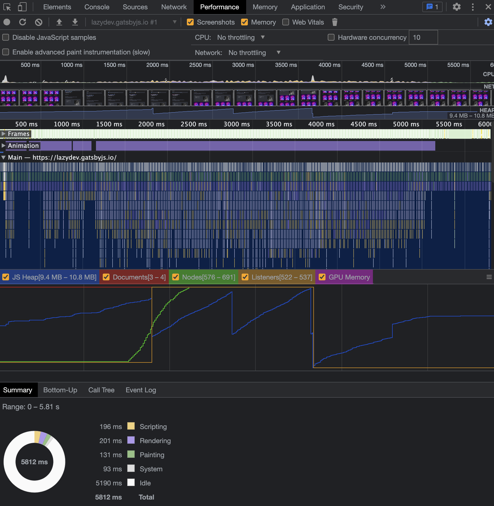

Performance 기록 결과 화면

엄청난 양의 데이터로 인해 뭐부터 봐야할지 감이 안 잡힐 수도 있습니다. 천천히 하나씩 들여다 보며 이해 해보겠습니다.

### CPU Utilization & FilmStrip

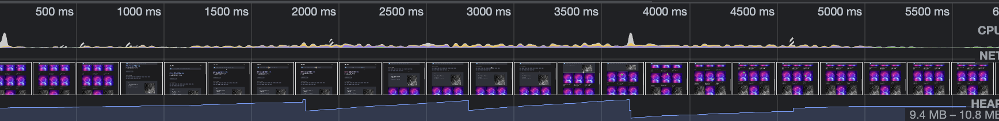

Timeline

상단의 CPU 타임라인에선 Critical Rendering Path(Javascript, style, layout, paint, composite)과 ajax 호출 등을 보여줍니다. 주로 JavaScript(노란색) 및 레이아웃 작업(보라색)과 같은 다양한 유형의 작업으로 인해 CPU가 얼마나 열일하는지 봅니다. 사진에서 보이듯 CPU 활동은 처음 활동을 시작한 후 상당히 조용해 집니다.

중앙의 FilmStrip은 왼쪽부터 시간순으로 나열되며 프레임 스크린샷을 통해 각 순간의 사이트가 어떤 모습 인지 볼 수 있습니다. 이러한 애플리케이션의 시각적 상태는 “screenshot” 옵션을 체크했을 때만 존재합니 다. FilmStrip 위로 마우스를 가져가면 해당 시점의 스크린샷을 크게 볼 수 있습니다.

하단 부분은 애플리케이션의 메모리 추세를 보여줍니다. 위 예시 사진에서 메모리가 증가하고 잠시 후 감소 하는 것을 볼 수 있습니다. 일반적으로 가비지 컬렉션 프로세스가 발생할 때까진 메모리가 증가합니다.

### User Timing metrix

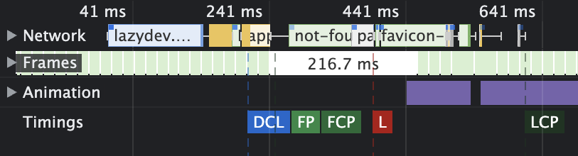

로딩에 관한 지표들

타이밍 레인에는 FP, DCL, L 등 이벤트도 표시됩니다.

자세히 설명하자면 이 글이 너무 길어지고 내용이 산으로 갈 것 같아 각 지표들의 의미만 살펴보고 넘어가 겠습니다.  
해당 부분에 대한 건 따로 다른 글에서 자세히 설명하겠습니다.

- FP (First Paint): 페이지 네비게이션 후, 첫 픽셀을 그린 순간
- FCP (First Contentful Paint): 첫 엘리먼트를 그린 순간
- LCP (Largest Contentful Paint): 가장 큰 엘리먼트를 그린 순간
- DCL (Dom Content Loaded): DOM Tree를 구성하고, 스크립트(+ defer 스크립트)를 실행 완료했을 때 → defer 스크립트가 없다면 FP 전에 DCL이 올 수 있습니다.
- L (Load): 다큐먼트의 리소스들을 모두 로드 완료했을 때

### CPU flame chart

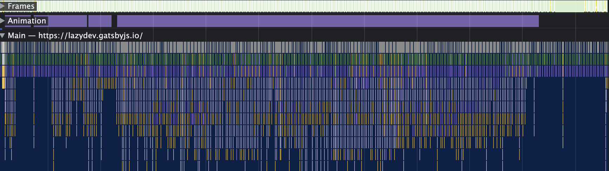

Flame chart

가장 핵심 부분이라고 생각합니다. 플레임 차트는 기록하는 동안 웹 페이지의 JS 실행을 시각적으로 표현한 것입니다. **성능 병목 현상이 발생할 수 있는 위치**를 이해하는 데 중요한 부분입니다. 수평 레이어로 구 성되며 각 레이어는 단일 JS 함수를 나타냅니다. 각 함수 블록의 너비는 함수의 실행 기간을 나타내고 색상 은 작업 유형(스크립팅, 렌더링, 페인팅…)을 나타냅니다. 그러므로 이 섹션에서 **어떤 함수가 호출되었고 각 함수가 얼마나 오래 걸렸는지 정확하게 분석**할 수 있습니다.

위 사진에는 안 나왔지만 Register, GPU, Compositor 등 성능 문제 디버깅에 유용한 섹션들이 있습니다. 몇 가지 설명드리겠습니다.

**Network 섹션**은 다운로드 요청과 완료 시간을 볼 수 있습니다. 그리고 **Main 섹션**은 렌더러의 메인 스레드로, 알록달록한 색으로 된 지표들을 통해 프레임의 전체 시간과 프레임을 연장하는 데 가장 큰 영향 을 미친 기능을 확인할 수 있습니다. 노란색은 자바스크립트가 실행 중임을 나타냅니다.

이해를 쉽게 돕기 위해 UI 업데이트 또는 CPU 작업과 연관시키는 데 특히 유용한 Network 섹션을 통해 [Stripe](https://stripe.com/) 홈페이지를 디버깅하는 예시를 들어 보겠습니다.

아래 사진은 폰트 로드가 완료되기 직전의 Stripe 홈페이지입니다.

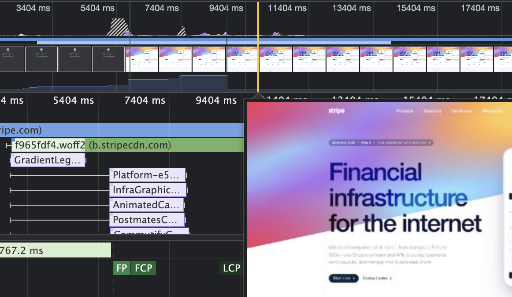

stripe example

여기서 UI에 변경 사항이 있으면 네트워크 요청 섹션을 통해 UI 업데이트를 **지연**시키고 있던 **네트워 크 요청**을 이렇게 식별할 수 있습니다.

폰트 파일을 로드한 직후의 아래 사진에서 UI가 다운로드한 폰트를 사용해 재렌더링되었음을 확인할 수 있 습니다.

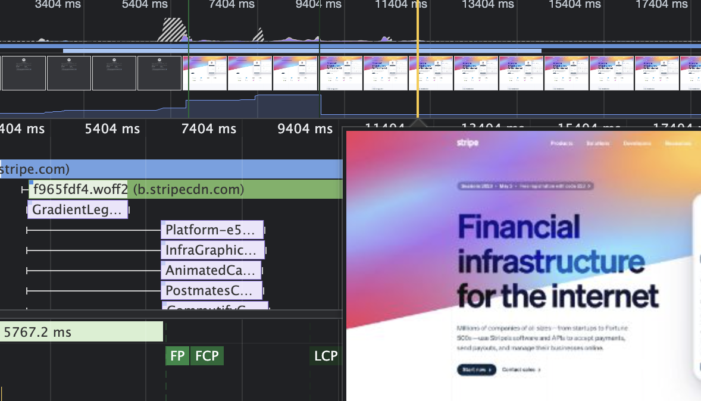

stripe example2

### Memory

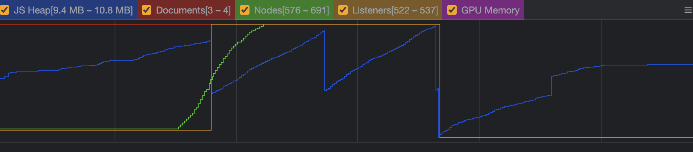

DOM 노드, 리스너 및 기타 메트릭이 이 차트에 요약되어 있습니다.

DOM 노드, 리스너 및 기타 메트릭이 이 차트에 요약되어 있습니다. 색상별로 노드, 리스너 등을 구분할 수 있습니다. 이 부분에서 앱의 추세를 볼 수 있으며 주로 **메모리 누수를 추적**할 때 유용하게 사용할 수있 습니다.

### CPU activity breakdown

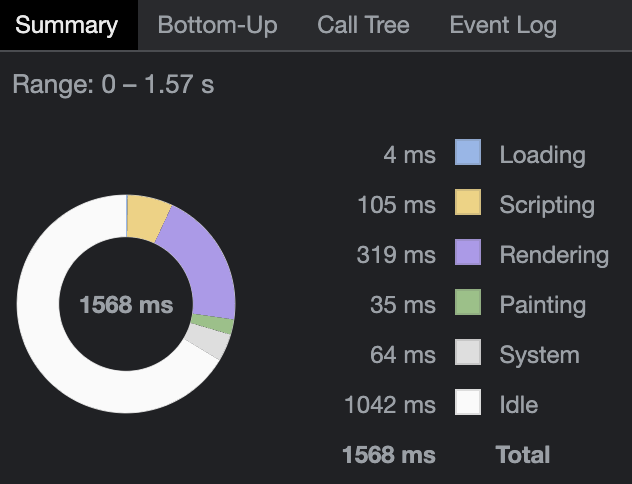

Aggregated task breakdown

`Summary` 탭에서는 특정 CPU 작업을 선택하지 않은 경우, CPU 작업 내역이 다음 4가지 범주로 분류되어 표 시됩니다.

- **Loading**: 네트워크 요청 및 HTML 파싱
- **Scripting**: JS 코드 파싱, 컴파일링 및 실행, 가비지 컬렉션(GC) 포함
- **Rendering**: 스타일 및 레이아웃 계산
- **Painting**: 이미지 페인팅, 합성, 리사이징 및 디코딩

다른 쓰레드를 클릭하거나 위쪽 및 아래쪽 화살표 방향키를 사용해서 다른 쓰레드를 선택할 수 있습니다.

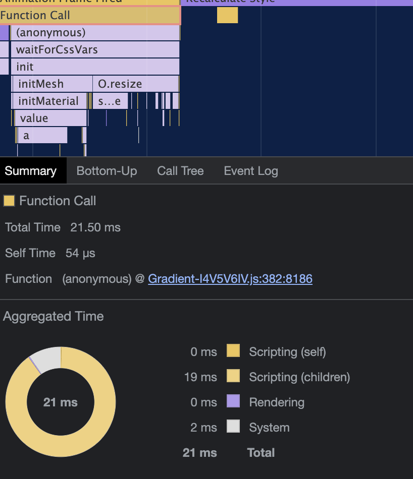

위 사진은 flame chart에서 특정 Function Call을 선택했습니다. 하단의 Aggregated Time은 해당 Function Call의 CPU 분석을 보여줍니다. 또한 링크(Graient~~~ )를 클릭하면 개발 도구의 소스 패널에 있는 코드 줄 로 이동합니다.

---

`Bottom-Up` 탭에서는 CPU 활동에 대한 보다 세분화된 분석을 볼 수 있습니다.

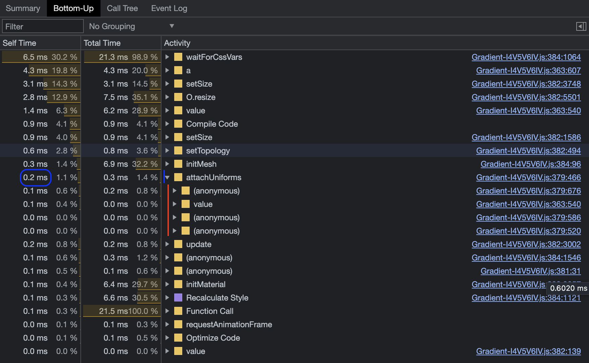

위 사진처럼 하위 수준의 함수를 확장해서 어떤 코드가 함수를 호출하는지 확인할 수 있습니다. 이렇게 하 면 제어할 수 있는 코드를 찾는 데 도움됩니다.

---

`Call Tree` 탭은 기록하는 동안 실행된 JS 함수의 계층적 표현입니다. 호출 트리는 가장 시간이 많이 걸리 는 기능을 식별하는 데 도움이 됩니다.

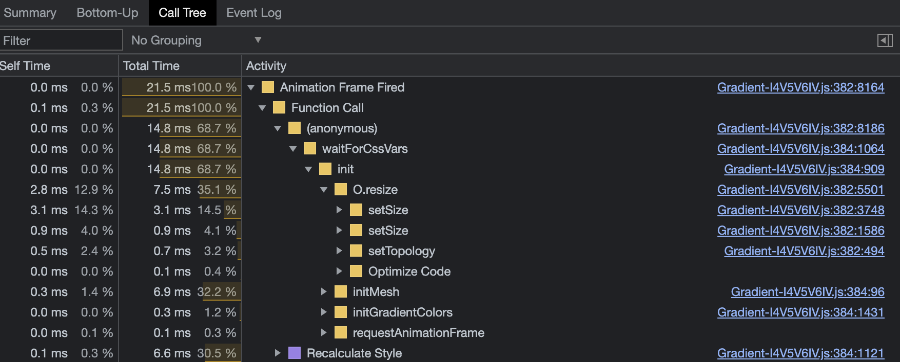

호출 트리

위 사진에서 보이듯이 하향식 구조로 구성되며 시간이 가장 많이 걸리는 기능이 맨 위에 표시됩니다. 각 기 능은 총 시간, 자체 시간 및 호출 횟수와 함께 나열됩니다.

플레임 차트와 호출 트리 모두 JS 함수 실행에 대한 통찰을 제공하지만 서로 다른 방식으로 정보를 제공하 고 다른 용도로 사용됩니다. 각 차트의 설명은 위에서 했으니, 둘 사이의 차이점과 각각의 장점을 살펴보겠 습니다.

`플레임 차트`의 장점

- 성능 문제를 일으킬 수 있는 장기 실행 함수 또는 코드 블록을 **빠르게 식별**할 수 있습니다.
- 서로 다른 기능 간의 관계와 실행 순서를 보여줍니다.

`호출 트리`의 장점

- 실행 시간 측면에서 가장 비용이 많이 드는 기능을 식별하는 데 도움이 되므로 **최적화 작업의 우선 순 위**를 쉽게 지정할 수 있습니다.
- 함수별 호출 횟수를 보여주기 때문에 필요 이상으로 **자주 호출**될 수 있는 함수를 정확히 찾아낼 수있 습니다.
- 함수 실행에 대한 집계 보기를 제공하여 전체 성능 비용에 대해 보다 명확한 관점을 제공합니다.

따라서 플레임 차트는 JS 실행에 대해 시간순의 시각적 개요를 제공하는 데 탁월한 반면, 호출 트리는 반복 되는 코드 호출을 집계하므로 평균적으로 어디서 시간이 소요되는지 쉽게 확인할 수 있습니다. 이렇듯 모두 고유한 장점이 있으며 함께 사용하면 성능 병목 현상을 보다 효과적으로 식별하고 해결하는 데 도움이 될수 있겠죠.

## 마무리

이 외에도 웹 바이탈과 프레임 등 다양한 항목도 표시할 수 있는 좋은 기능들을 제공합니다.

이제 Performance 탭에서 성능 결과 보고서를 보고 이해할 수 있을 겁니다. 당연하겠지만 보다 편안하게 사 용하려면 연습밖에 없습니다. 본인이 만든 웹 페이지를 프로파일링하고 결과를 분석해보세요. 그러다보면웹 애플리케이션의 성능 병목 현상을 식별하고 해결할 수 있을 겁니다.

마지막으로 런타임 성능을 향상시키는 방법에는 여러 가지가 있습니다. 몇 가지 일반적인 최적화 전략은 다 음과 같습니다.

- JavaScript의 실행을 최적화 (rAF 메소드를 사용한다던가, 오래 실행되는 JS를 메인 스레드에서 웹 워커 로 이동한다던가 말이죠)
- 캐싱, 압축 및 CDN을 활용하여 네트워크 요청을 최적화
- 스타일 계산의 범위와 복잡성 감소

프론트엔드 개발자라면 꼭 이러한 방법들을 숙지하시면 좋을 것 같습니다.

### 참고

- [https://tv.naver.com/v/23652467](https://tv.naver.com/v/23652467)
- [https://www.debugbear.com/blog/devtools-performance](https://www.debugbear.com/blog/devtools-performance)
- [https://yonatankra.com/how-to-profile-javascript-performance-in-the-browser/](https://yonatankra.com/how-to-profile-javascript-performance-in-the-browser/)
- [https://developer.chrome.com/docs/devtools/performance/](https://developer.chrome.com/docs/devtools/performance/)
