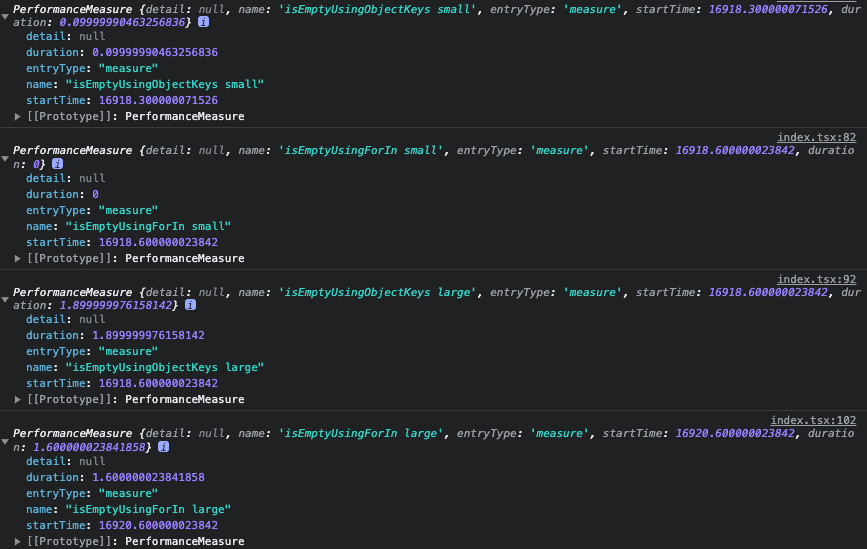

`Object.keys` 메서드와 `for…in` 루프를 활용해 자바스크립트에서 객체가 비어 있는지 확인하는 방법에
대해 살펴보겠습니다.

자바스크립트에서 객체는 다른 객체로부터 속성을 상속받아 프로토타입 체인을 생성할 수 있습니다.
**`for...in`** 반복문을 사용하여 객체의 속성을 반복할 때, 객체 자체의 속성 뿐만 아니라 프로토타입
체인에서 상속받은 속성도 열거합니다. 이러한 방법을 통해 상속받은 속성이 있는 객체를 다루는 경우에
어떻게 이 방법들을 사용할 수 있는지 자세히 알아보겠습니다.

이를 이해하면 데이터 구조를 처리하고 코드의 가독성을 향상시킬 때 도움이 됩니다. 각 방법의 원리와
적절한 사용 사례를 이해하기 위해 간단하게 알아보도록 하겠습니다.

## 상속된 속성이 있는 객체 다룰 때

프로토타입 객체와 이 프로토타입에서 속성을 상속받는 다른 객체가 있다고 가정해 보겠습니다.

```tsx
const prototypeObj = {
  inheritedProp1: 'value1',
  inheritedProp2: 'value2',
};

const obj = Object.create(prototypeObj);
obj.ownProp1 = 'ownValue1';
obj.ownProp2 = 'ownValue2';
```

### Object.keys 활용

`Object.keys` 를 사용해 `obj` 의 키를 얻으면 상속받은 것이 아닌 자체 속성만 반환됩니다.

```tsx
console.log(Object.keys(obj)); // ['ownProp1', 'ownProp2']
```

### for…in 루프 활용

반면에 `for…in` 루프를 사용하면 자체 속성뿐만 아니라 상속받은 속성도 모두 반복합니다.

```tsx
for (let key in obj) {
  console.log(key); // 'ownProp1', 'ownProp2', 'inheritedProp1', 'inheritedProp2'
}
```

### hasOwnProperty와 함께 for…in 루프 활용

상속받은 속성을 걸러내고 객체 자체의 속성에만 중점을 둘 수 있도록 `for...in` 루프 내에서
`hasOwnProperty` 메서드를 사용할 수 있습니다.

```tsx
for (let key in obj) {
  if (obj.hasOwnProperty(key)) {
    console.log(key); // 'ownProp1', 'ownProp2'
  }
}
```

## Object.keys 메서드 활용

`Object.keys` 메서드는 객체의 모든 열거 가능한 속성을 나열하여 배열로 반환하는 데 유용합니다. 이
방법을 사용하면 객체에 포함된 키의 수를 기준으로 빈 객체를 쉽게 확인할 수 있습니다. 이 방법을 사용한
코드는 아래와 같습니다.

```tsx
const isEmptyUsingObjectKeys = <T extends Record<string, unknown>>(obj: T) => {
  return Object.keys(obj).length === 0;
};

console.log(isEmpty({})); // true
console.log(isEmpty({ a: 1 })); // false
```

이 방법은 매우 간단하며 높은 가독성을 제공합니다.

### 적절한 사용 사례

- 작은 객체: 객체의 모든 속성을 반복하여 key 배열을 구축한 다음, 이 배열의 길이를 확인하여 객체가
  비어 있는지 확인합니다. 따라서 큰 객체에 대해선 사용하지 않는 게 좋습니다.
- 코드 단순화: 최적화보다 가독성이 우선일 때 사용할 때 좋은 선택지입니다.

## for...in 루프 활용

반면에 `for...in` 루프는 **프로토타입 체인을 통해 상속받은 것을 포함**하여 객체의 모든 열거 가능한
속성을 순환합니다. 이를 통해 상속된 속성이 있는 객체를 다룰 때, 이 방법이 더욱 유연할 수 있습니다.
`for...in` 루프를 사용하여 작성한 함수는 다음과 같습니다:

```tsx
const prototypeObj = {
  inheritedProp1: 'value1',
};
const obj = Object.create(prototypeObj);

const isEmptyUsingForIn = <T extends Record<string, unknown>>(obj: T) => {
  for (const key in obj) {
    return false;
  }

  return true;
};

console.log(isEmptyUsingForIn({})); // true
console.log(isEmptyUsingForIn({ a: 1 })); // false
console.log(isEmptyUsingForIn(obj)); // false
```

- 상속: `Object.keys` 와 달리 프로토타입 체인을 따라 속성을 확인할 수 있습니다.
- 유연성: 속성이 발견되면 루프를 조기에 끊을 수 있으므로 큰 객체에서 일찍 일치하는 경우 성능 이점을
  제공할 수 있습니다.

### 적절한 사용 사례

- 큰 객체: 속성을 찾는 즉시 일찍 종료될 수 있습니다(조기에 브레이크가 발생할 수 있는 경우). 때문에
  비어 있지 않은 큰 객체에 대해 `Object.keys` 메서드보다 잠재적으로 빠르게 수행될 수 있습니다.
- 상속: 객체가 프로토타입에서 상속받은 모든 속성을 알고 싶을 때 유용합니다. 다만 주의할 점은 객체에
  깊은 프로토타입 체인이 있는 경우 결과에 복잡성이 추가될 수 있습니다. 많은 속성을 나열하게 되어
  객체에 직접 속하는 속성을 분리하기가 더 어려워집니다.

## hasOwnProperty와 함께 for...in 루프 활용

`for…in` 루프를 사용하면서, 프로토타입 체인에서 상속받은 속성을 걸러내고 객체 자체의 속성에만 중점을
두도록 할 수 있습니다. `for…in` 루프 내에서 `Object.prototype.hasOwnProperty` 메서드를 함께 사용하면
됩니다.

```tsx
const prototypeObj = {
  inheritedProp1: 'value1',
};
const obj = Object.create(prototypeObj);

const isEmptyUsingForInWithHasOwnProperty = <T extends Record<string, unknown>>(obj: T) => {
  for (const key in obj) {
    if (Object.prototype.hasOwnProperty.call(obj, key)) {
      return false;
    }
  }

  return true;
};

console.log(isEmptyUsingForInWithHasOwnProperty({})); // true
console.log(isEmptyUsingForInWithHasOwnProperty({ a: 1 })); // false
console.log(isEmptyUsingForInWithHasOwnProperty(obj)); // true
```

프로토타입 체인에서 속성을 제외하기 위해서 `hasOwnProperty` 검사가 필요하므로 약간 복잡해 보일 수
있습니다. 마찬가지로 큰 객체를 처리할 때 유용합니다.

## 벤치마크

우선 테스트 할 데이터로 작은 객체 하나, 큰 객체 하나를 준비 하겠습니다.

```tsx
const smallObject = {
  a: 1,
  b: 2,
  c: 3,
  d: 4,
  e: 5,
  f: 6,
  g: 7,
  h: 8,
  i: 9,
  j: 10,
};

let largeObject = {};
for (let i = 0; i < 100_000; i++) {
  largeObject = { ...largeObject, [i]: i };
}
```

아래 사진은 `measure()` 메서드를 사용해서 성능 측정을 한 결과입니다. JavaScript 엔진 최적화,
시스템의 기타 백그라운드 작업 등 다양한 요소로 인해 `measure()` 또는 `console.time`을 사용한 측정은
항상 정확한 결과를 제공하지 않으므로 참고만 하면 될 것 같습니다.



|       | Object.keys() | for…in Loop |
| ----- | ------------- | ----------- |
| small | 0.09s         | 0s          |
| large | 1.89s         | 1.6s        |

## 결론

상속된 속성의 맥락에서 각 메서드를 적절하게 사용하는 방법을 이해하면 객체에 대해 미묘하고 효과적인
접근 방식이 가능합니다. **상속된 속성이 있는 객체를 처리하냐**에 따라 `Object.keys` 또는 `for…in`
루프를 사용하면 되겠습니다. 이 부분을 제외하면 `Object.keys` 메서드는 일반적으로 더 읽기 쉽고, 특히
작은 객체에서 사용하면 좋습니다. `for...in` 루프는 큰 객체의 경우 선택사항이 될 수 있습니다.

이런 측면에선 어느 게 더 빠른가에 대해서는 중요하지 않습니다. 벤치마크를 통해 볼 수 있듯 속도에 있어
성능 차이가 크지 않습니다. 여기에 최적화를 위해 시간을 쏟아부어도 얻는 효과는 크지 않다는 것이죠.
그리고 Donald Knuth가 말했듯이
`약 97%의 경우 작은 효율성은 잊어야 하며 성급한 최적화는 모든 악의 근원`입니다. 중요한 것은 필요한
코드를 최적화 해야 하는 것입니다. 데이터 모델을 잘 설계했다면 데이터 모델로 인해 문제가 발생할
가능성은 거의 없습니다. 문제를 발견하면 코드를 프로파일링하고 원인을 찾고 그때 최적화해도 됩니다.

## 참고

- [MDN:Object.keys()](https://developer.mozilla.org/ko/docs/Web/JavaScript/Reference/Global_Objects/Object/keys)
- [MDN:for…in](https://developer.mozilla.org/ko/docs/Web/JavaScript/Reference/Statements/for...in)
